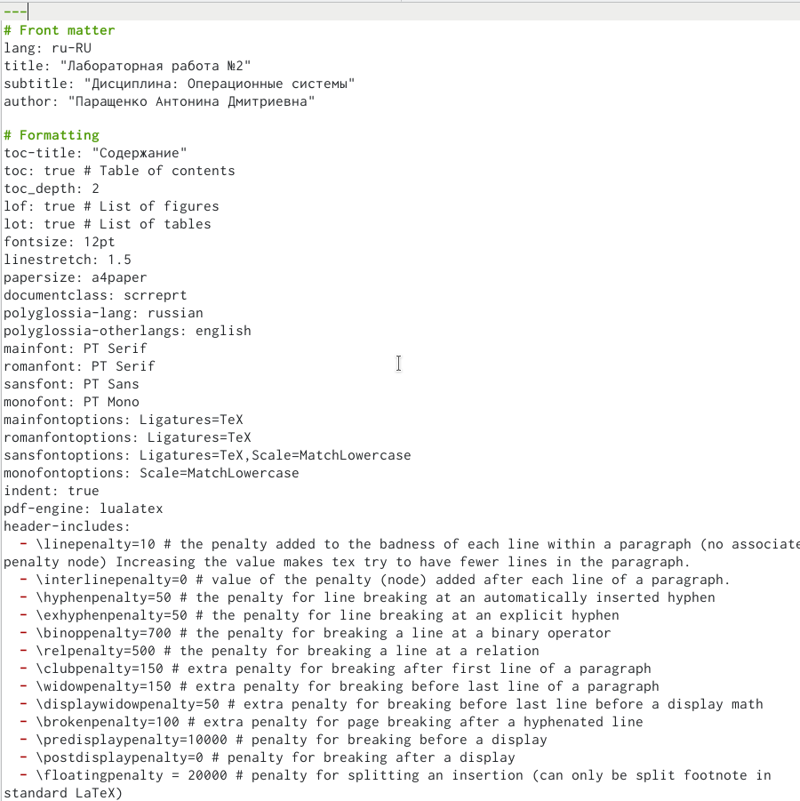
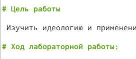
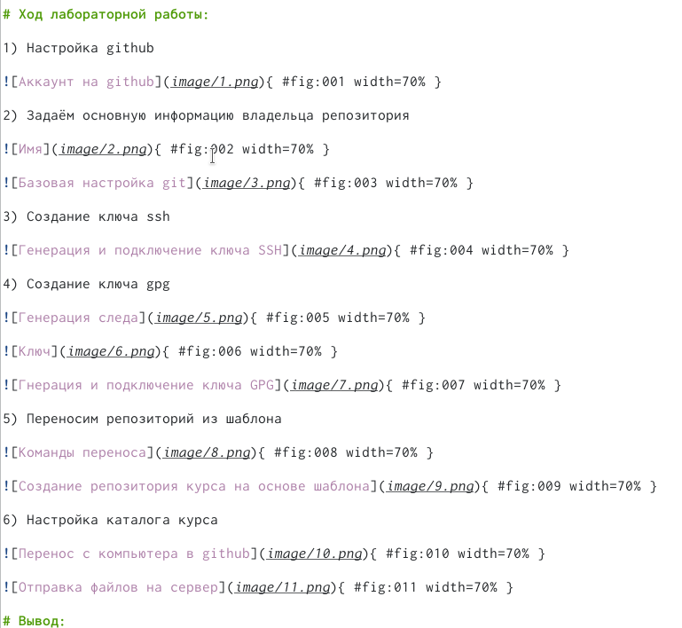
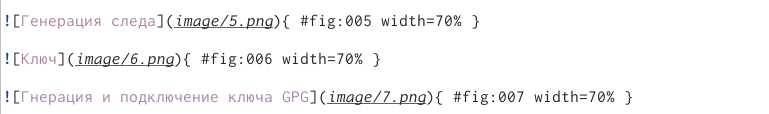
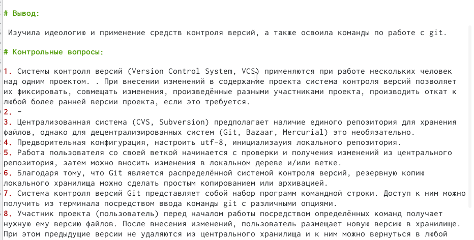
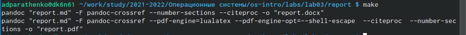
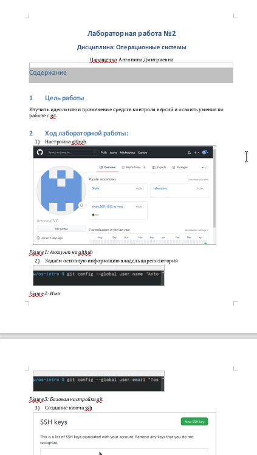
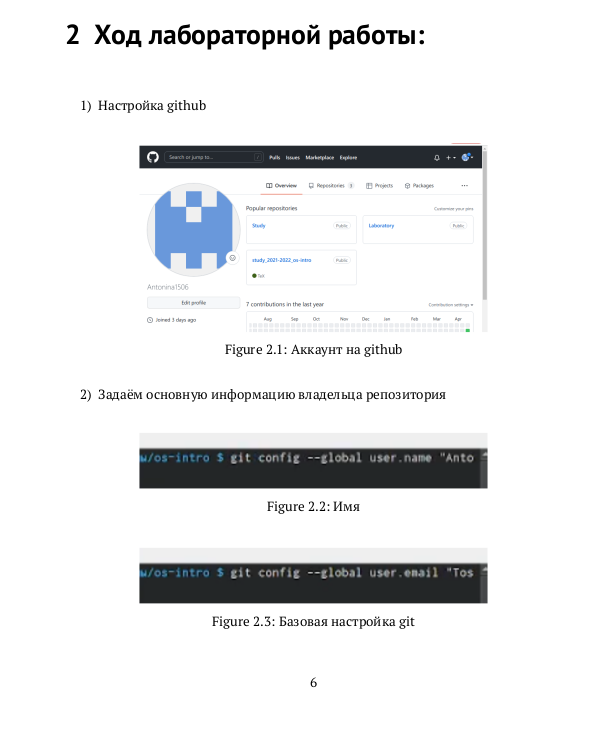

---
## Front matter
lang: ru-RU
title: Отчёт по лабораторной работе №3
author: |
	Паращенко Антонина
institute: |
	РУДН, Москва, Россия

date: 27 апреля 2022

## Formatting
toc: false
slide_level: 2
theme: metropolis
header-includes: 
 - \metroset{progressbar=frametitle,sectionpage=progressbar,numbering=fraction}
 - '\makeatletter'
 - '\beamer@ignorenonframefalse'
 - '\makeatother'
aspectratio: 43
section-titles: true
---

# Цель работы

 Научиться оформлять отчёты с помощью легковесного языка разметки Markdown.

# Ход лабораторной работы

## Используем шаблон из github

{ #fig:001 width=70% }

## Создаём заголовки

{ #fig:002 width=70% }

## Прописываем ход выполнения лабораторной работы

{ #fig:003 width=70% }

## Вставка изображений в отчёт

{ #fig:004 width=70% }

## Оформляем вывод и контрольные вопросы

{ #fig:005 width=70% }

## Конвертация файла типа md в типы pdf и docx

{ #fig:006 width=70% }

## Проверяем файл docx формате

{ #fig:007 width=70% }

## Проверяем файл pdf формате

{ #fig:008 width=70% }

# Вывод: 

 Научилась оформлять отчёты с помощью легковесного языка разметки Markdown и в качестве практики оформила отчёт к лабораторной работе №2.
