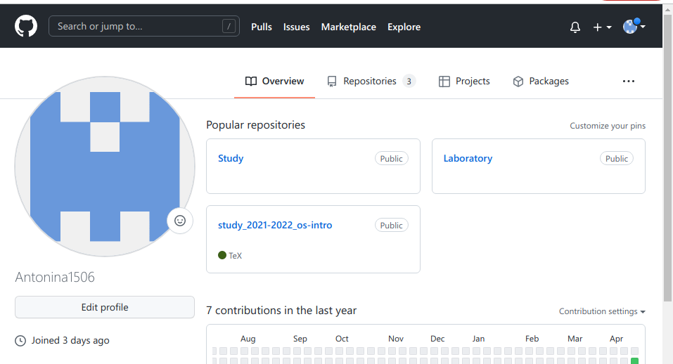
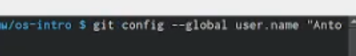
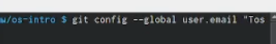
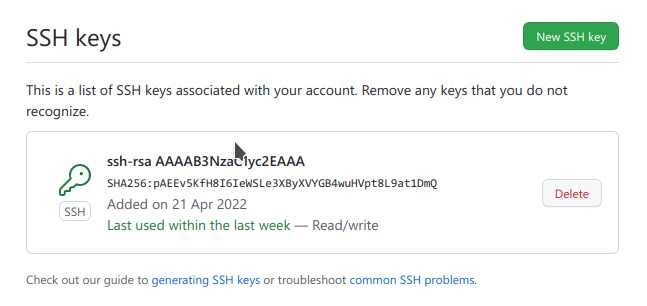
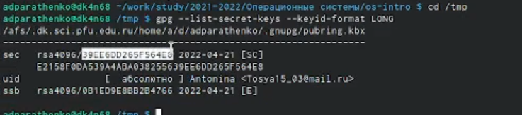
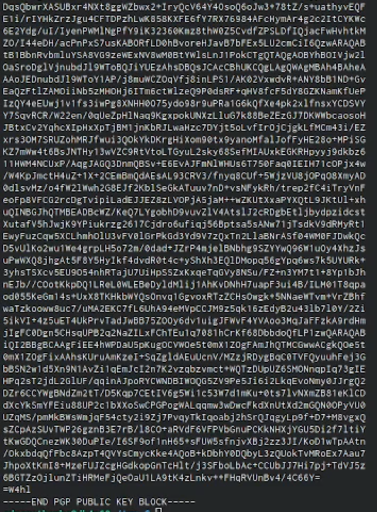
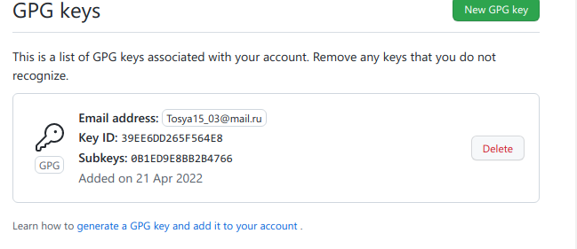
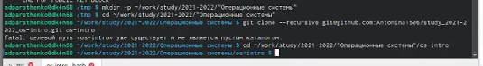
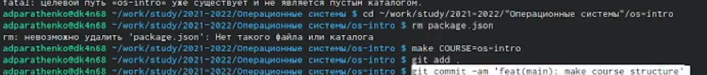
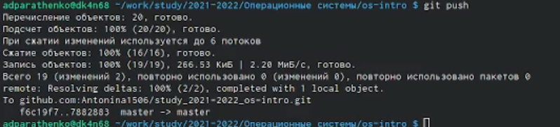

#РОССИЙСКИЙ УНИВЕРСИТЕТ ДРУЖБЫ НАРОДОВ#
 
##Факультет физико-математических и естественных наук##
##Кафедра прикладной информатики и теории вероятностей##
 
 
 
 
 
 
 
 
##ОТЧЁТ##
##ПО ЛАБОРАТОРНОЙ РАБОТЕ №2##
 
###дисциплина: Операционные системы###
 
 
 
 
 
 
 
 
 
 
 
 
 
 
 
 
 
 
 
 
 
 
 
####Студент: Паращенко Антонина####
####Группа: НПМбд-02-21####
 
 
 
 
####Москва####
####2022 г.####
 
###Цель работы: изучить идеологию и применение средств контроля версий и освоить умения по работе с git.###
 
###Ход лабораторной работы:###
 
- Настройка github
 

######Рис. Аккаунт на github######
 
- Задаём основную информацию владельца репозитория
 

######Рис. Базовая настройка git######
 
- Создание ключа ssh
 

######Рис. Генерация и подключение ключа SSH######
 
- Создание ключа gpg

######Рис. Гнерация и подключение ключа GPG######
 
- Переносим репозиторий из шаблона
 

######Рис. Создание репозитория курса на основе шаблона######
 
- Настройка каталога курса
 

######Рис. Отправка файлов на сервер######
 
 
####Вывод: изучила идеологию и применение средств контроля версий, а также освоила команды по работе с git.
 
 
####Контрольные вопросы:####
 
 
1. Системы контроля версий (Version Control System, VCS) применяются при работе нескольких человек над одним проектом. . При внесении изменений в содержание проекта система контроля версий позволяет их фиксировать, совмещать изменения, произведённые разными участниками проекта, производить откат к любой более ранней версии проекта, если это требуется. 
2. - 
3. Централизованная система (CVS, Subversion) предполагает наличие единого репозитория для хранения файлов, однако для децентрализированных систем (Git, Bazaar, Mercurial) это необязательно. 
4. Предворительная конфигурация, настроить utf-8, инициализауия локального репозитория. 
5. Работа пользователя со своей веткой начинается с проверки и получения изменений из центрального репозитория, затем можно вносить изменения в локальном дереве и/или ветке. 
6. Благодаря тому, что Git является распределённой системой контроля версий, резервную копию локального хранилища можно сделать простым копированием или архивацией. 
7. Система контроля версий Git представляет собой набор программ командной строки. Доступ к ним можно получить из терминала посредством ввода команды git с различными опциями. 
8. Участник проекта (пользователь) перед началом работы посредством определённых команд получает нужную ему версию файлов. После внесения изменений, пользователь размещает новую версию в хранилище. При этом предыдущие версии не удаляются из центрального хранилища и к ним можно вернуться в любой момент. Сервер может сохранять не полную версию изменённых файлов, а производить так называемую дельтакомпрессию — сохранять только изменения между последовательными версиями, что позволяет уменьшить объём хранимых данных. 
9. Под каждую новую функцию должна быть отведена собственная ветка, которую можно отправлять в центральный репозиторий для создания резервной копии или совместной работы команды. 

