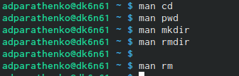

---
## Front matter
lang: ru-RU
title: Отчёт по лабораторной работе №4
author: |
	Паращенко Антонина
institute: |
	РУДН, Москва, Россия

date: 28 апреля 2022

## Formatting
toc: false
slide_level: 2
theme: metropolis
header-includes: 
 - \metroset{progressbar=frametitle,sectionpage=progressbar,numbering=fraction}
 - '\makeatletter'
 - '\beamer@ignorenonframefalse'
 - '\makeatother'
aspectratio: 43
section-titles: true
---

## Цель работы

Приобретение практических навыков взаимодействия пользователя с системой посредством командной строки.

# Ход лабораторной работы

## Определяем полное имя домашнего каталога с помощью функции pwd

{ #fig:001 width=100% }

## Переходим в каталог /tmp и просматриваем его содержимое с помощью функции ls и её различных опций

### Переход в каталог /tmp

{ #fig:002 width=100% }

### Результат вызова команды ls

{ #fig:003 width=80% }

## Переходим в каталог /tmp и просматриваем его содержимое с помощью функции ls и её различных опций
	
### Результат использования функции -a
	
{ #fig:004 width=70% }
	
### Результат использования функции -F 
	
{ #fig:005 width=70% }

## Переходим в каталог /tmp и просматриваем его содержимое с помощью функции ls и её различных опций
	
### Результат использования функции -l
	
{ #fig:006 width=80% }

## Переходим в каталог /tmp и просматриваем его содержимое с помощью функции ls и её различных опций	
	
### Результат использования функции -alF
	
{ #fig:007 width=80% }

## Проверяем есть ли в каталоге /var/spool подкаталог с именем cron

{ #fig:008 width=100% }

## В домашнем каталоге создаём новый каталог с именем newdir

{ #fig:009 width=100% }
 
## В каталоге ~/newdir создаём новый каталог с именем morefun

{ #fig:010 width=100% }
 
## В домашнем каталоге создаём одной командой три новых каталога с именами letters, memos, misk 

{ #fig:011 width=100% }

## Затем удаляем эти каталоги letters, memos, misk

{ #fig:012 width=100% }

## С помощью команды man определяем, какую опцию команды ls нужно использовать для просмотра содержимое не только указанного каталога, но и подкаталогов, входящих в него.

{ #fig:013 width=60% }

## С помощью команды man определяем, какую опцию команды ls нужно использовать для просмотра содержимое не только указанного каталога, но и подкаталогов, входящих в него.

{ #fig:014 width=80% }

## С помощью команды man определяем набор опций команды ls, позволяющий отсортировать по времени последнего изменения выводимый список содержимого каталога с развёрнутым описанием файлов

{ #fig:015 width=80% }

## Используем команду man для просмотра описания следующих команд: cd, pwd, mkdir, rmdir, rm

### Вызываем команду man
	
{ #fig:016 width=70% }
	
### Описание pwd
	
{ #fig:017 width=70% }

## Используем команду man для просмотра описания следующих команд: cd, pwd, mkdir, rmdir, rm
	
### Описание mkdir 
	
{ #fig:018 width=80% }

## Используем команду man для просмотра описания следующих команд: cd, pwd, mkdir, rmdir, rm
	
### Описание rmdir
	
{ #fig:019 width=80% }

## Используем команду man для просмотра описания следующих команд: cd, pwd, mkdir, rmdir, rm
	
### Описание rm
	
{ #fig:020 width=60% }

## Используем команду man для просмотра описания следующих команд: cd, pwd, mkdir, rmdir, rm
	
### Описание cd
	
{ #fig:021 width=60% }
	
## Используя информацию, полученную при помощи команды history, выполняем модификацию и исполнение нескольких команд из буфера команд 

### Вызов команды history
	
{ #fig:022 width=50% }

## Используя информацию, полученную при помощи команды history, выполняем модификацию и исполнение нескольких команд из буфера команд 

### Модификация команды

{ #fig:023 width=100% }

### Модификация команды

{ #fig:024 width=100% }

## Вывод: 
Приобрела практические навыки взаимодействия пользователя с системой посредством командной строки.

# Контрольные вопросы
## Ответы
1. Что такое командная строка?
Командная строка - инструмент непосредственного общения пользователя и компьютера без внешней оболочки (интерфейса).

2. При помощи какой команды можно определить абсолютный путь текущего каталога? Приведите пример.
Абсолютный путь к текщему каталогу можно определить с помощью команды pwd.

3. При помощи какой команды и каких опций можно определить только тип файлов и их имена в текущем каталоге? Приведите примеры.
С помощью команды ls и опций -F (тип файлов) и -A (имена) можно отпределить тип файлов и их имена в текущем каталоге.

## Ответы
4. Каким образом отобразить информацию о скрытых файлах? Приведите примеры.
С помощью команды ls и опции -a можно определить информацию о скрытих файлах.

5. При помощи каких команд можно удалить файл и каталог? Можно ли это сделать одной итой же командой? Приведите примеры.
С помощью команды rmdir можно удалять только каталоги. Спомощью команды rm можно удалять файлы и каталоги, для последних используется опция -r.

## Ответы
6. Каким образом можно вывести информацию о последних выполненных пользователем командах?
С помощью команды history можно вывести информацию о последних выполненных пользователем командах.

7. Как воспользоваться историей команд для их модифицированного выполнения? Приведите примеры.
С помощью команды !<номер_команды>:s/<что_меняем>/<на_что_меняем> можно модифицировать ранее использованные команды.

## Ответы
8. Приведите примеры запуска нескольких команд в одной строке.
mkdir try do sleep - команда создания 3 каталогов в одной строке.

9. Дайте определение и приведите примера символов экранирования.
Экранирование символов - способ использование служебных символов в качестве неслужебних символов. 
cd Рабочий\ стол/. \ здесь происходить экранирование пробела (разделяющего сивола), чтобы использовать этот символ в названии каталога.

## Ответы
10. Охарактеризуйте вывод информации на экран после выполнения команды ls с опцией l.
Чтобы вывести на экран подробную информацию о файлах и каталогах,необходимо использовать опцию -l. При этом о каждом файле и каталоге будет выведена следующая информация:тип файла,право доступа,число ссылок,владелец,размер,дата последней ревизии,имя файла или каталога.

11. Что такое относительный путь к файлу? Приведите примеры использования относительного и абсолютного пути при выполнении какой-либо команды.
Относительный путь linux - это путь к файлу относительно текущей папки. 
$ ls /home/tmp/file1 - абсолютный путь
$ ls ~/tmp/file1 - относительный путь (с текущего (домашнего) каталога)

## Ответы
12. Как получить информацию об интересующей вас команде?
С помощью команды man можно получить интересующую Вас информацию о любой команде.

