---
## Front matter
title: "Отчёт по лабораторной работе №4"
author: "Паращенко Антонина Дмитриевна"

## Generic otions
lang: ru-RU
toc-title: "Содержание"

## Bibliography
bibliography: bib/cite.bib
csl: pandoc/csl/gost-r-7-0-5-2008-numeric.csl

## Pdf output format
toc: true # Table of contents
toc-depth: 2
lof: true # List of figures
lot: true # List of tables
fontsize: 12pt
linestretch: 1.5
papersize: a4
documentclass: scrreprt
## I18n polyglossia
polyglossia-lang:
  name: russian
  options:
	- spelling=modern
	- babelshorthands=true
polyglossia-otherlangs:
  name: english
## I18n babel
babel-lang: russian
babel-otherlangs: english
## Fonts
mainfont: PT Serif
romanfont: PT Serif
sansfont: PT Sans
monofont: PT Mono
mainfontoptions: Ligatures=TeX
romanfontoptions: Ligatures=TeX
sansfontoptions: Ligatures=TeX,Scale=MatchLowercase
monofontoptions: Scale=MatchLowercase,Scale=0.9
## Biblatex
biblatex: true
biblio-style: "gost-numeric"
biblatexoptions:
  - parentracker=true
  - backend=biber
  - hyperref=auto
  - language=auto
  - autolang=other*
  - citestyle=gost-numeric
## Pandoc-crossref LaTeX customization
figureTitle: "Рис."
tableTitle: "Таблица"
listingTitle: "Листинг"
lofTitle: "Список иллюстраций"
lotTitle: "Список таблиц"
lolTitle: "Листинги"
## Misc options
indent: true
header-includes:
  - \usepackage{indentfirst}
  - \usepackage{float} # keep figures where there are in the text
  - \floatplacement{figure}{H} # keep figures where there are in the text
---

# Цель работы

Приобретение практических навыков взаимодействия пользователя с системой посредством командной строки.

# Ход лабораторной работы

1) Определяем полное имя домашнего каталога с помощью функции pwd (рис. [-@fig:001])

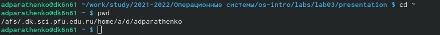{ #fig:001 width=70% }

2) Переходим в каталог /tmp и просматриваем его содержимое с помощью функции ls и её различных опций
	a) Переход в каталог /tmp (рис. [-@fig:002])
	
	{ #fig:002 width=70% }
	
	b) Результат вызова команды ls (рис. [-@fig:003])
	
	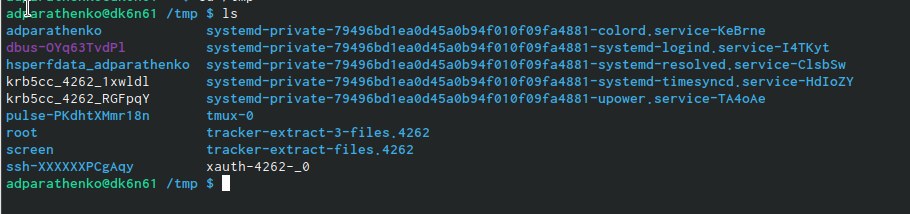{ #fig:003 width=70% }
	
	c) Результат использования функции -a (рис. [-@fig:004])
	
	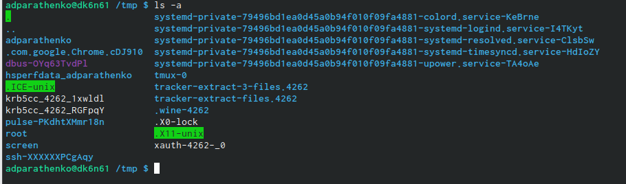{ #fig:004 width=70% }
	
	d) Результат использования функции -F (рис. [-@fig:005])
	
	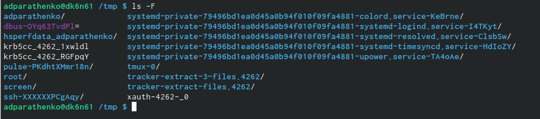{ #fig:005 width=70% }
	
	e) Результат использования функции -l (рис. [-@fig:006])
	
	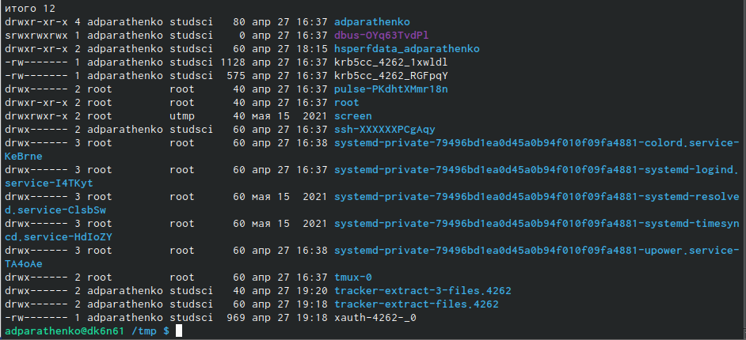{ #fig:006 width=70% }
	
	f) Результат использования функции -alF (рис. [-@fig:007])
	
	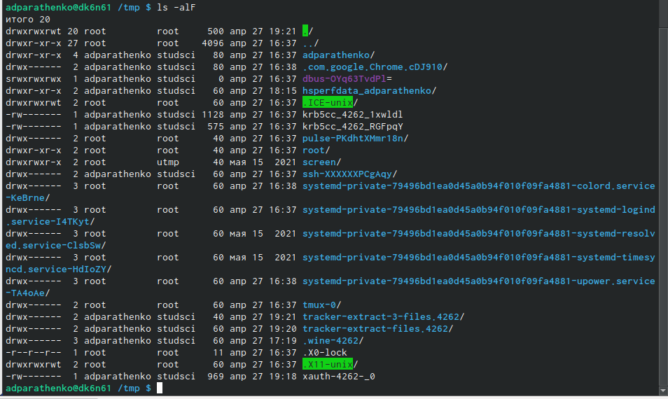{ #fig:007 width=70% }
	
3) Проверяем есть ли в каталоге /var/spool подкаталог с именем cron (рис. [-@fig:008])

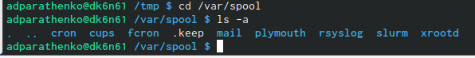{ #fig:008 width=70% }

4) В домашнем каталоге создаём новый каталог с именем newdir (рис. [-@fig:009])

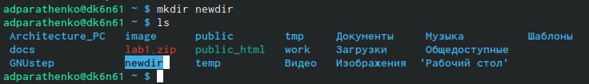{ #fig:009 width=70% }
 
5) В каталоге ~/newdir создаём новый каталог с именем morefun (рис. [-@fig:010])

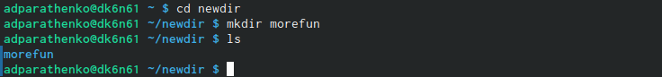{ #fig:010 width=70% }
 
6) В домашнем каталоге создаём одной командой три новых каталога с именами
letters, memos, misk (рис. [-@fig:011])

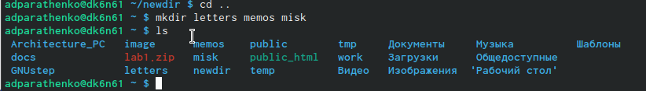{ #fig:011 width=70% }

8) Затем удаляем эти каталоги letters, memos, misk (рис. [-@fig:012])

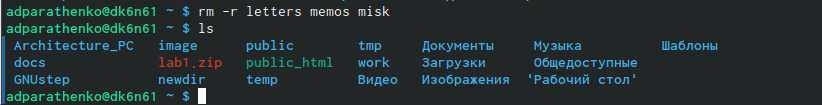{ #fig:012 width=70% }

9) С помощью команды man определяем, какую опцию команды ls нужно использовать для просмотра содержимое не только указанного каталога, но и подкаталогов,
входящих в него (рис. [-@fig:013]) (рис. [-@fig:014])

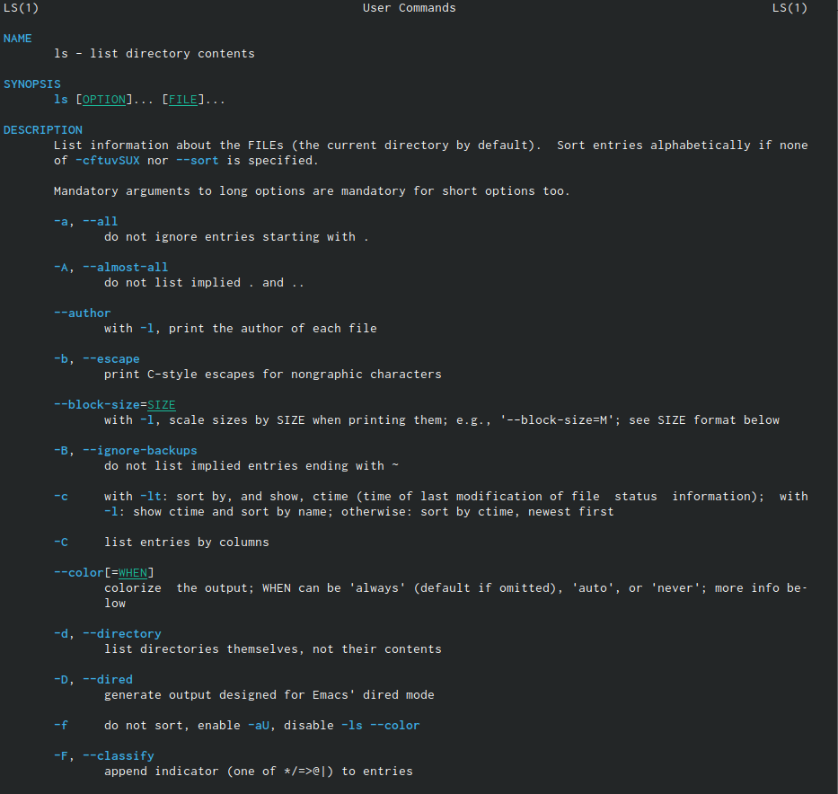{ #fig:013 width=70% }

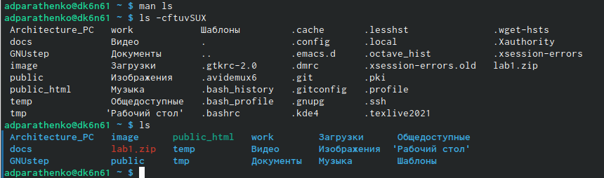{ #fig:014 width=70% }

10) С помощью команды man определяем набор опций команды ls, позволяющий отсортировать по времени последнего изменения выводимый список содержимого каталога с развёрнутым описанием файлов (рис. [-@fig:015])

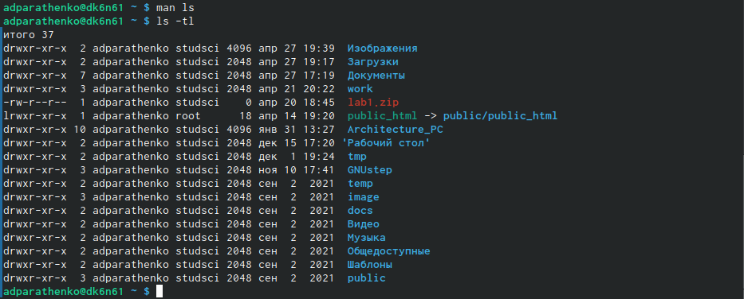{ #fig:015 width=70% }

11) Используем команду man для просмотра описания следующих команд: cd, pwd, mkdir,
rmdir, rm (рис. [-@fig:016]) - (рис. [-@fig:021])

	a) Вызываем команду man
	
	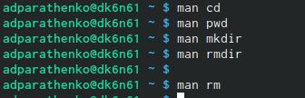{ #fig:016 width=70% }
	
	b) Описание pwd (рис. [-@fig:003])
	
	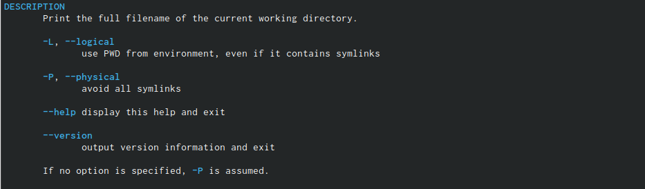{ #fig:017 width=70% }
	
	c) Описание mkdir (рис. [-@fig:004])
	
	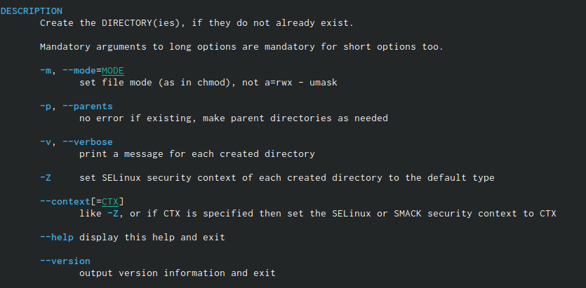{ #fig:018 width=70% }
	
	d) Описание rmdir (рис. [-@fig:005])
	
	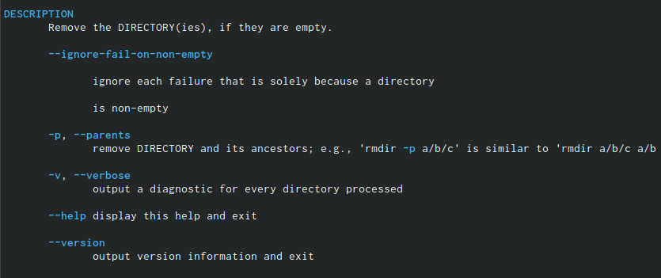{ #fig:019 width=70% }
	
	e) Описание rm (рис. [-@fig:006])
	
	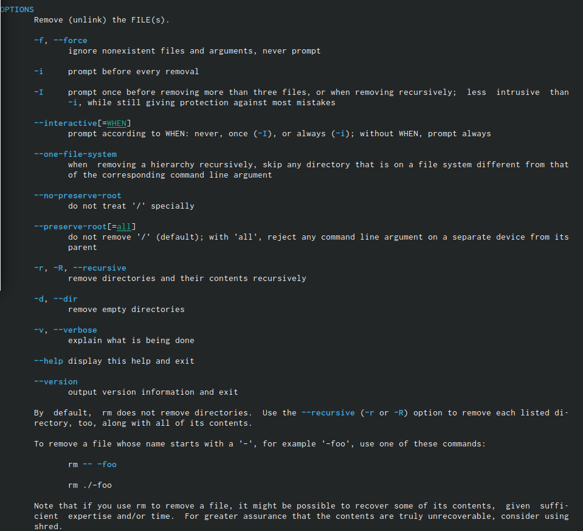{ #fig:020 width=70% }
	
	f) Описание cd (рис. [-@fig:002])
	
	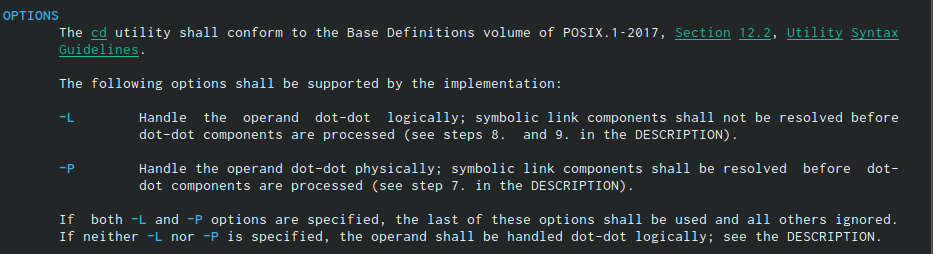{ #fig:021 width=70% }
	
	

12) Используя информацию, полученную при помощи команды history, выполняем модификацию и исполнение нескольких команд из буфера команд (рис. [-@fig:022]) - (рис. [-@fig:024])

{ #fig:022 width=70% }

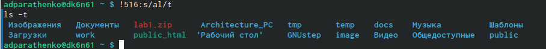{ #fig:023 width=70% }

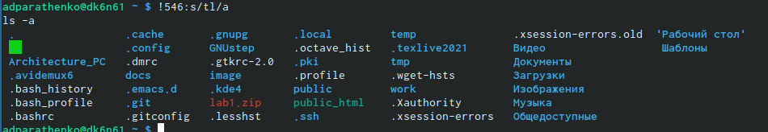{ #fig:024 width=70% }

# Выводы

Приобрела практические навыки взаимодействия пользователя с системой посредством командной строки.

# Контрольные вопросы

1. Что такое командная строка?
Командная строка - инструмент непосредственного общения пользователя и компьютера без внешней оболочки (интерфейса).

2. При помощи какой команды можно определить абсолютный путь текущего каталога? Приведите пример.
Абсолютный путь к текщему каталогу можно определить с помощью команды pwd.

3. При помощи какой команды и каких опций можно определить только тип файлов и их имена в текущем каталоге? Приведите примеры.
С помощью команды ls и опций -F (тип файлов) и -A (имена) можно отпределить тип файлов и их имена в текущем каталоге.

4. Каким образом отобразить информацию о скрытых файлах? Приведите примеры.
С помощью команды ls и опции -a можно определить информацию о скрытих файлах.

5. При помощи каких команд можно удалить файл и каталог? Можно ли это сделать одной итой же командой? Приведите примеры.
С помощью команды rmdir можно удалять только каталоги. Спомощью команды rm можно удалять файлы и каталоги, для последних используется опция -r.

6. Каким образом можно вывести информацию о последних выполненных пользователем командах?
С помощью команды history можно вывести информацию о последних выполненных пользователем командах.

7. Как воспользоваться историей команд для их модифицированного выполнения? Приведите примеры.
С помощью команды !<номер_команды>:s/<что_меняем>/<на_что_меняем> можно модифицировать ранее использованные команды.

8. Приведите примеры запуска нескольких команд в одной строке.
mkdir try do sleep - команда создания 3 каталогов в одной строке.

9. Дайте определение и приведите примера символов экранирования.
Экранирование символов - способ использование служебных символов в качестве неслужебних символов. 
cd Рабочий\ стол/. \ здесь происходить экранирование пробела (разделяющего сивола), чтобы использовать этот символ в названии каталога.

10. Охарактеризуйте вывод информации на экран после выполнения команды ls с опцией l.
Чтобы вывести на экран подробную информацию о файлах и каталогах,необходимо использовать опцию -l. При этом о каждом файле и каталоге будет выведена следующая информация:тип файла,право доступа,число ссылок,владелец,размер,дата последней ревизии,имя файла или каталога.

11. Что такое относительный путь к файлу? Приведите примеры использования относительного и абсолютного пути при выполнении какой-либо команды.
Относительный путь linux - это путь к файлу относительно текущей папки. 
$ ls /home/tmp/file1 - абсолютный путь
$ ls ~/tmp/file1 - относительный путь (с текущего (домашнего) каталога)

12. Как получить информацию об интересующей вас команде?
С помощью команды man можно получить интересующую Вас информацию о любой команде.

