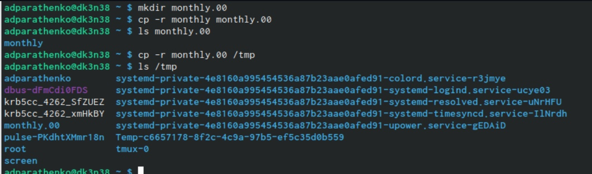
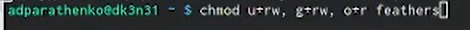

---
## Front matter
title: "Отчёт по лабораторной работе №5"
author: "Паращенко Антонина Дмитриевна"

## Generic otions
lang: ru-RU
toc-title: "Содержание"

## Bibliography
bibliography: bib/cite.bib
csl: pandoc/csl/gost-r-7-0-5-2008-numeric.csl

## Pdf output format
toc: true # Table of contents
toc-depth: 2
lof: true # List of figures
lot: true # List of tables
fontsize: 12pt
linestretch: 1.5
papersize: a4
documentclass: scrreprt
## I18n polyglossia
polyglossia-lang:
  name: russian
  options:
	- spelling=modern
	- babelshorthands=true
polyglossia-otherlangs:
  name: english
## I18n babel
babel-lang: russian
babel-otherlangs: english
## Fonts
mainfont: PT Serif
romanfont: PT Serif
sansfont: PT Sans
monofont: PT Mono
mainfontoptions: Ligatures=TeX
romanfontoptions: Ligatures=TeX
sansfontoptions: Ligatures=TeX,Scale=MatchLowercase
monofontoptions: Scale=MatchLowercase,Scale=0.9
## Biblatex
biblatex: true
biblio-style: "gost-numeric"
biblatexoptions:
  - parentracker=true
  - backend=biber
  - hyperref=auto
  - language=auto
  - autolang=other*
  - citestyle=gost-numeric
## Pandoc-crossref LaTeX customization
figureTitle: "Рис."
tableTitle: "Таблица"
listingTitle: "Листинг"
lofTitle: "Список иллюстраций"
lotTitle: "Список таблиц"
lolTitle: "Листинги"
## Misc options
indent: true
header-includes:
  - \usepackage{indentfirst}
  - \usepackage{float} # keep figures where there are in the text
  - \floatplacement{figure}{H} # keep figures where there are in the text
---

# Цель работы

Ознакомиться с файловой системой Linux, её структурой, именами и содержанием
каталогов, приобрести практические навыки по применению команд для работы
с файлами и каталогами, по управлению процессами (и работами), по проверке использования диска и обслуживанию файловой системы.

# Ход лабораторной работы
## Выполнение примеров из текста лабораторной работы

1) Копируем файл в текущем каталоге (рис. [-@fig:001])

{ #fig:001 width=70% }

2) Копируем несколько файлов в каталог (рис. [-@fig:002])
	
{ #fig:002 width=70% }
	
3) Копируем файлы в произвольном каталоге (рис. [-@fig:003])
	
{ #fig:003 width=70% }
	
4) Копируем каталоги в текущем каталоге (рис. [-@fig:004])
	
{ #fig:004 width=70% }
	
5) Копируем каталоги в произвольном каталоге (рис. [-@fig:005])
	
{ #fig:005 width=70% }
	
6) Переименовываем файлы в текущем каталоге (рис. [-@fig:006])
	
{ #fig:006 width=70% }
	
7) Перемещаем файлов в другой каталог (рис. [-@fig:007])
	
{ #fig:007 width=70% }
	
8) Переименовываем каталоги в текущем каталоге (рис. [-@fig:008])

{ #fig:008 width=70% }

9) Перемещаем каталог в другой каталог (рис. [-@fig:009])

{ #fig:009 width=70% }
 
10) Переименовываем каталог, не являющийся текущим (рис. [-@fig:010])

{ #fig:010 width=70% }
 
11) Создаём файл ~/may с правом выполнения для владельца (рис. [-@fig:011])

{ #fig:011 width=70% }

12) Лишаем владельца файла may права выполнение (рис. [-@fig:012])

{ #fig:012 width=70% }

13) Создаём каталог monthly с запретом на чтение для членов группы и всех
остальных пользователей (рис. [-@fig:013])

{ #fig:013 width=70% }

14) Создаём файл ~/abc1 с правом записи для членов группы. (рис. [-@fig:014])

{ #fig:014 width=70% }

15) Скопируем файл /usr/include/sys/io.h в домашний каталог и назовём его equipment (рис. [-@fig:015])

{ #fig:015 width=70% }

16) В домашнем каталоге создаём директорию ~/ski.plases. Перемещаем файл equipment в каталог ~/ski.plases и переименовываем файл ~/ski.plases/equipment в ~/ski.plases/equiplist (рис. [-@fig:016]) 

{ #fig:016 width=70% }

17) Создаём в домашнем каталоге файл abc1 и копируем его в каталог ~/ski.plases, называем его equiplist2. (рис. [-@fig:017])

{ #fig:017 width=70% }

18) Создаём каталог с именем equipment в каталоге ~/ski.plases. Перемещаем файлы ~/ski.plases/equiplist и equiplist2 в каталог ~/ski.plases/equipment (рис. [-@fig:018])

{ #fig:018 width=70% }

19) Создаём и перемещаем каталог ~/newdir в каталог ~/ski.plases и называем его plans. (рис. [-@fig:019])

{ #fig:019 width=70% }

20) Определяем опции команды chmod, необходимые для того, чтобы присвоить перечисленным ниже файлам выделенные права доступа. (рис. [-@fig:020]) - (рис. [-@fig:023])

{ #fig:020 width=70% }

{ #fig:021 width=70% }

{ #fig:022 width=70% }

{ #fig:023 width=70% }

21) Просматриваем содержимое файла /etc/password. (рис. [-@fig:014])

{ #fig:024 width=70% }

22) Скопируем файл ~/feathers в файл ~/file.old. Перемещаем файл ~/file.old в каталог ~/play. Скопируем каталог ~/play в каталог ~/fun. Перемещаем каталог ~/fun в каталог ~/play и называем его games (рис. [-@fig:025])

{ #fig:025 width=70% }

23) Лишаем владельца файла ~/feathers права на чтение и видим, что мы не имеем доступ, чтобы прочитать файл (рис. [-@fig:026])

{ #fig:026 width=70% }

24) Лишаем владельца каталога ~/play права на выполнение и видим, что права доступа к каталогу изменились. (рис. [-@fig:027])

{ #fig:027 width=70% }

25) Прочитаем man по командам mount, fsck, mkfs, kill. (рис. [-@fig:028]) - (рис. [-@fig:032]

{ #fig:028 width=70% }

{ #fig:029 width=70% }

{ #fig:030 width=70% }

{ #fig:031 width=70% }

{ #fig:032 width=70% }

# Вывод

Ознакомилась с файловой системой Linux, её структурой, именами и содержанием каталогов, приобрела практические навыки по применению команд для работы с файлами и каталогами, по управлению процессами (и работами), по проверке использования диска и обслуживанию файловой системы.
