---
## Front matter
title: "Отчёт по лабораторной работе №6"
author: "Паращенко Антонина Дмитриевна"

## Generic otions
lang: ru-RU
toc-title: "Содержание"

## Bibliography
bibliography: bib/cite.bib
csl: pandoc/csl/gost-r-7-0-5-2008-numeric.csl

## Pdf output format
toc: true # Table of contents
toc-depth: 2
lof: true # List of figures
lot: true # List of tables
fontsize: 12pt
linestretch: 1.5
papersize: a4
documentclass: scrreprt
## I18n polyglossia
polyglossia-lang:
  name: russian
  options:
	- spelling=modern
	- babelshorthands=true
polyglossia-otherlangs:
  name: english
## I18n babel
babel-lang: russian
babel-otherlangs: english
## Fonts
mainfont: PT Serif
romanfont: PT Serif
sansfont: PT Sans
monofont: PT Mono
mainfontoptions: Ligatures=TeX
romanfontoptions: Ligatures=TeX
sansfontoptions: Ligatures=TeX,Scale=MatchLowercase
monofontoptions: Scale=MatchLowercase,Scale=0.9
## Biblatex
biblatex: true
biblio-style: "gost-numeric"
biblatexoptions:
  - parentracker=true
  - backend=biber
  - hyperref=auto
  - language=auto
  - autolang=other*
  - citestyle=gost-numeric
## Pandoc-crossref LaTeX customization
figureTitle: "Рис."
tableTitle: "Таблица"
listingTitle: "Листинг"
lofTitle: "Список иллюстраций"
lotTitle: "Список таблиц"
lolTitle: "Листинги"
## Misc options
indent: true
header-includes:
  - \usepackage{indentfirst}
  - \usepackage{float} # keep figures where there are in the text
  - \floatplacement{figure}{H} # keep figures where there are in the text
---

# Цель работы

Ознакомиться с инструментами поиска файлов и фильтрации текстовых данных и приобрести практические навыки: по управлению процессами (и заданиями), по
проверке использования диска и обслуживанию файловых систем.

# Ход лабораторной работы
## Сортировка файлов
Записываем в файл file.txt названия файлов, содержащихся в каталоге /etc. Допи-
шите в этот же файл названия файлов, содержащихся в вашем домашнем каталоге. (рис. [-@fig:001]) - (рис. [-@fig:002])

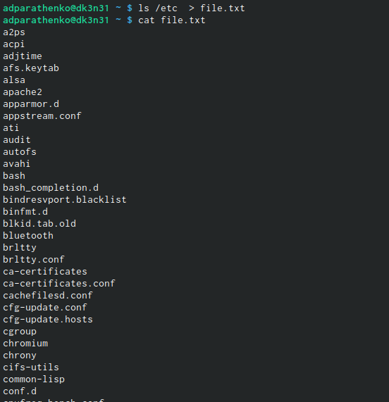{ #fig:001 width=70% }

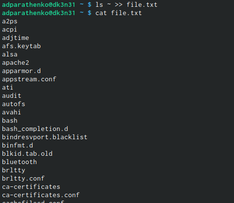{ #fig:002 width=70% }

## Поиск файлов и запись в файлы
Выводим имена всех файлов из file.txt, имеющих расширение .conf, после чего
записываем их в новый текстовой файл conf.txt (рис. [-@fig:003])
	
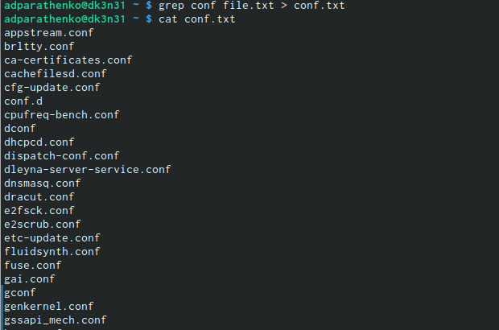{ #fig:003 width=70% }
	
## Поиск файлов 
Определяем, какие файлы в нашем домашнем каталоге имеют имена, начинавшиеся
с символа 'c'. (рис. [-@fig:004]) - (рис. [-@fig:005])
	
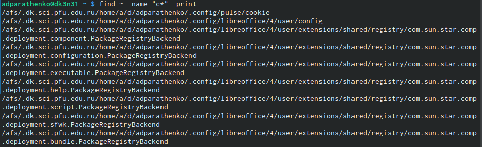{ #fig:004 width=70% }

{ #fig:005 width=70% }
	
## Вывод на экран
Выводим на экран имена файлов из каталога /etc, начинающиеся
с символа h. (рис. [-@fig:006])
	
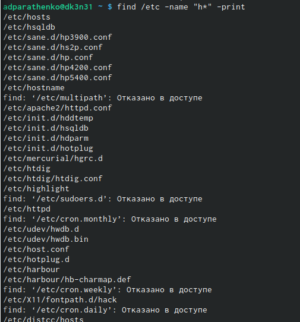{ #fig:006 width=70% }
	
## Фоновый режим работы
Запускаем в фоновом режиме процесс, который будет записывать в файл ~/logfile
файлы, имена которых начинаются с log. (рис. [-@fig:007])
	
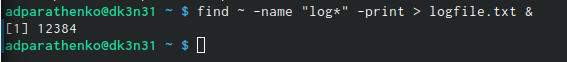{ #fig:007 width=70% }

## Удаление файлов
Удаляем файл ~/logfile (рис. [-@fig:008])
	
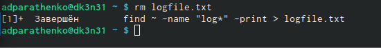{ #fig:008 width=70% }

## Фоновый режим работы
Запускаем из консоли в фоновом режиме редактор gedit (рис. [-@fig:009])

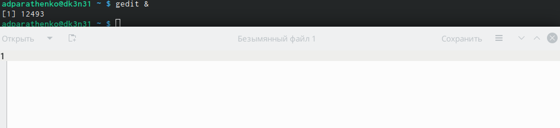{ #fig:009 width=70% }

## Идентификатор процесса
Определяем идентификатор процесса gedit, используя команду ps, конвейер и фильтр
grep. (рис. [-@fig:010])

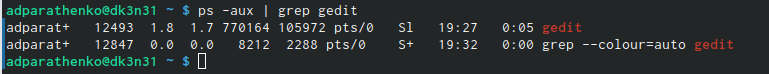{ #fig:010 width=70% }
 
## Звершение фонового процесса
Читаем справку (man) команды kill, после чего используем её для завершения
процесса gedit.(рис. [-@fig:011])

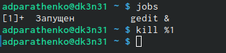{ #fig:011 width=70% }
 
## Выполнение команд
Выполняем команды df и du, предварительно получив более подробную информацию
об этих командах, с помощью команды man (рис. [-@fig:012]) - (рис. [-@fig:013])

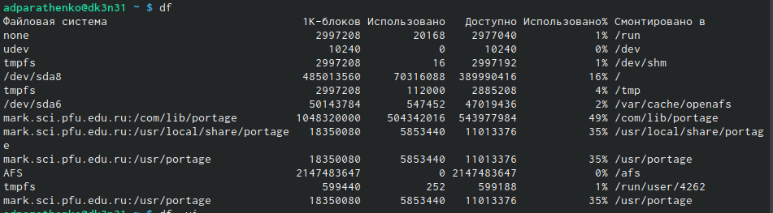{ #fig:012 width=70% }

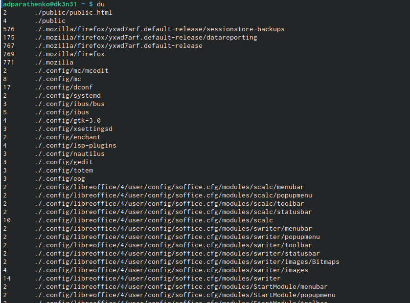{ #fig:013 width=70% }

## Вывод директорий
Воспользовавшись справкой команды find, выводим имена всех директорий, имею-
щихся в вашем домашнем каталоге. (рис. [-@fig:014])

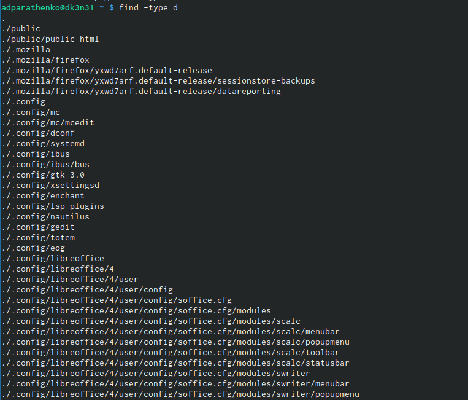{ #fig:014 width=70% }

# Вывод

Ознакомилась с инструментами поиска файлов и фильтрации текстовых данных и приобрела практические навыки: по управлению процессами (и заданиями), по
проверке использования диска и обслуживанию файловых систем.
