---
## Front matter
title: "Отчёт по лабораторной работе №7"
author: "Паращенко Антонина Дмитриевна"

## Generic otions
lang: ru-RU
toc-title: "Содержание"

## Bibliography
bibliography: bib/cite.bib
csl: pandoc/csl/gost-r-7-0-5-2008-numeric.csl

## Pdf output format
toc: true # Table of contents
toc-depth: 2
lof: true # List of figures
lot: true # List of tables
fontsize: 12pt
linestretch: 1.5
papersize: a4
documentclass: scrreprt
## I18n polyglossia
polyglossia-lang:
  name: russian
  options:
	- spelling=modern
	- babelshorthands=true
polyglossia-otherlangs:
  name: english
## I18n babel
babel-lang: russian
babel-otherlangs: english
## Fonts
mainfont: PT Serif
romanfont: PT Serif
sansfont: PT Sans
monofont: PT Mono
mainfontoptions: Ligatures=TeX
romanfontoptions: Ligatures=TeX
sansfontoptions: Ligatures=TeX,Scale=MatchLowercase
monofontoptions: Scale=MatchLowercase,Scale=0.9
## Biblatex
biblatex: true
biblio-style: "gost-numeric"
biblatexoptions:
  - parentracker=true
  - backend=biber
  - hyperref=auto
  - language=auto
  - autolang=other*
  - citestyle=gost-numeric
## Pandoc-crossref LaTeX customization
figureTitle: "Рис."
tableTitle: "Таблица"
listingTitle: "Листинг"
lofTitle: "Список иллюстраций"
lotTitle: "Список таблиц"
lolTitle: "Листинги"
## Misc options
indent: true
header-includes:
  - \usepackage{indentfirst}
  - \usepackage{float} # keep figures where there are in the text
  - \floatplacement{figure}{H} # keep figures where there are in the text
---

# Цель работы

Освоить основные возможности командной оболочки Midnight Commander и приоб-
рести навыки практической работы по просмотру каталогов и файлов; манипуляций
с ними.

# Ход лабораторной работы
## Подменю файл
Используем возможности подменю Файл (рис. [-@fig:001])

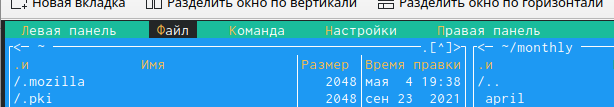{ #fig:001 width=70% }

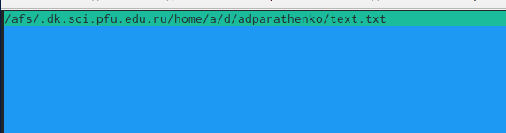{ #fig:002 width=70% }

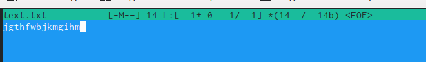{ #fig:003 width=70% }

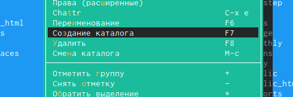{ #fig:004 width=70% }

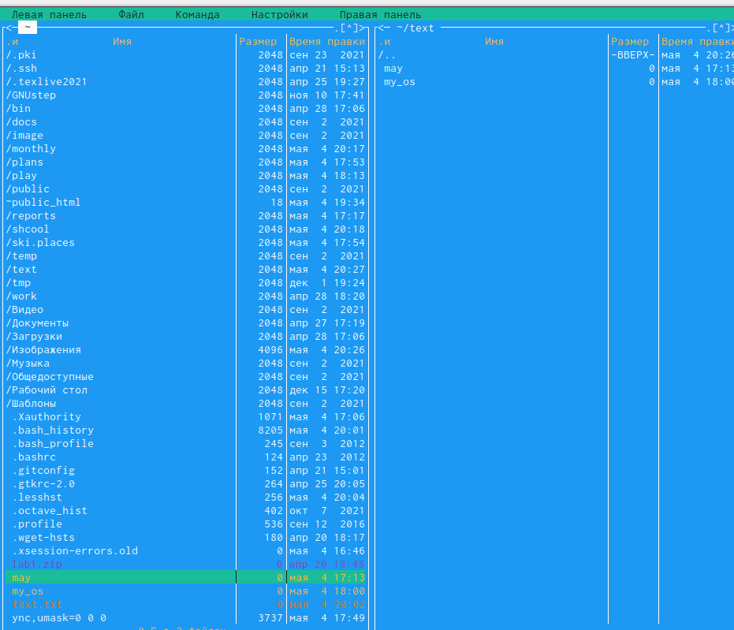{ #fig:005 width=70% }

## Подменю Команда
Используем возможности подменю Файл (рис. [-@fig:006])

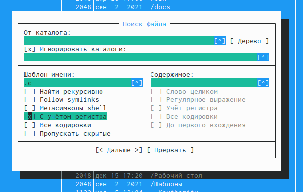{ #fig:006 width=70% }

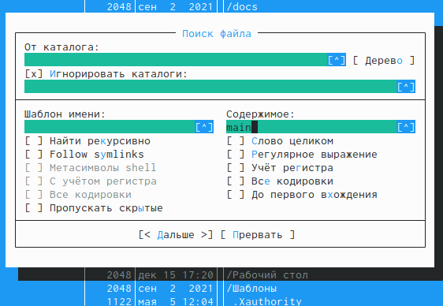{ #fig:007 width=70% }

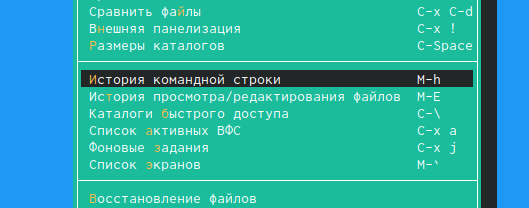{ #fig:008 width=70% }

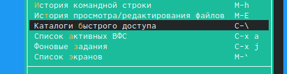{ #fig:009 width=70% }

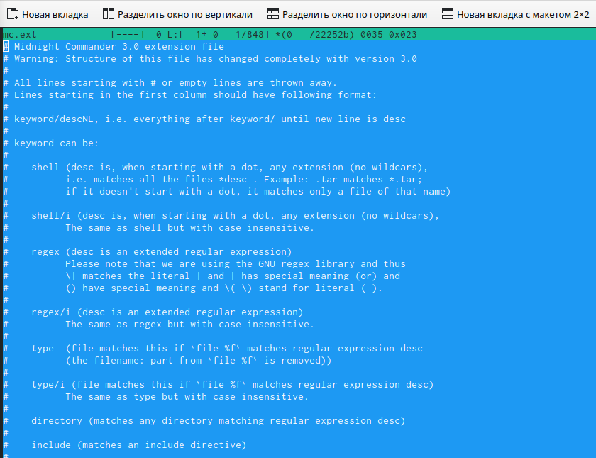{ #fig:010 width=70% }

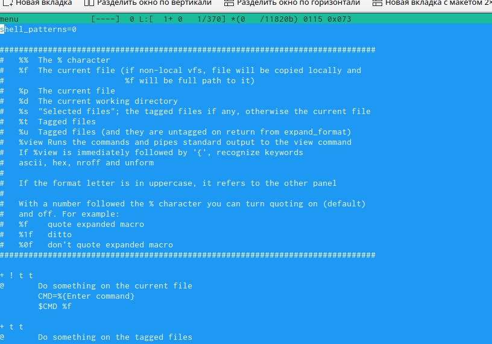{ #fig:011 width=70% }

## Подменю Настройки

{ #fig:012 width=70% }

## Работа с файлом
Открываем файл text.txt в редакторе mc и вставляем туда текст (рис. [-@fig:013])

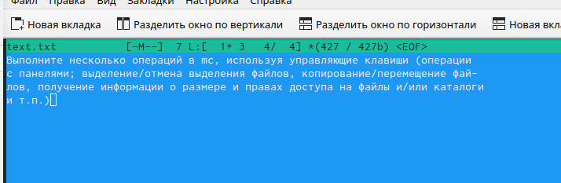{ #fig:013 width=70% }

Работаем с файлом. Сохраняем и закрываем его.(рис. [-@fig:014])

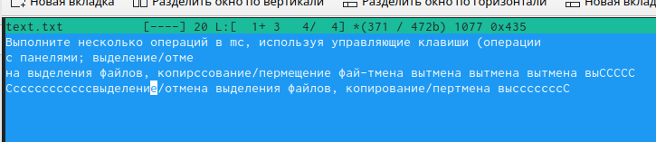{ #fig:014 width=70% }

Используя меню редактора, включите подсветку синтаксиса, если она не включена,
или выключите, если она включена (рис. [-@fig:015]) 
	
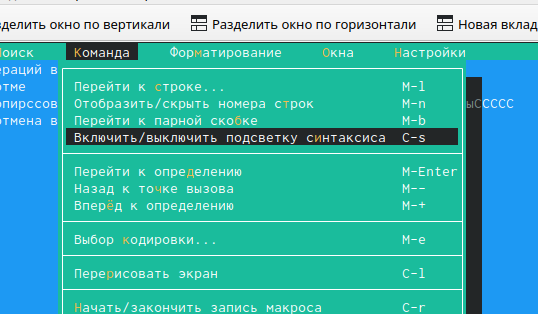{ #fig:015 width=70% }

# Вывод

Ознакомилась с инструментами поиска файлов и фильтрации текстовых данных и приобрела практические навыки: по управлению процессами (и заданиями), по
проверке использования диска и обслуживанию файловых систем.
