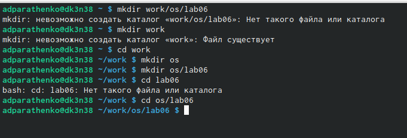
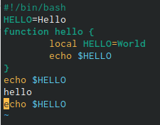
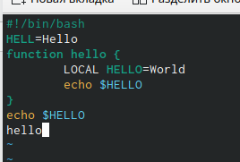
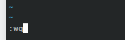
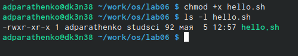
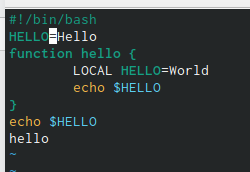
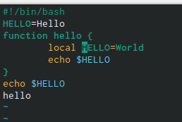
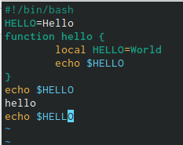
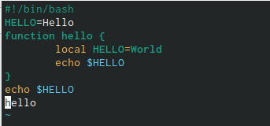
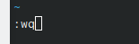

---
## Front matter
title: "Отчёт по лабораторной работе №8"
author: "Паращенко Антонина Дмитриевна"

## Generic otions
lang: ru-RU
toc-title: "Содержание"

## Bibliography
bibliography: bib/cite.bib
csl: pandoc/csl/gost-r-7-0-5-2008-numeric.csl

## Pdf output format
toc: true # Table of contents
toc-depth: 2
lof: true # List of figures
lot: true # List of tables
fontsize: 12pt
linestretch: 1.5
papersize: a4
documentclass: scrreprt
## I18n polyglossia
polyglossia-lang:
  name: russian
  options:
	- spelling=modern
	- babelshorthands=true
polyglossia-otherlangs:
  name: english
## I18n babel
babel-lang: russian
babel-otherlangs: english
## Fonts
mainfont: PT Serif
romanfont: PT Serif
sansfont: PT Sans
monofont: PT Mono
mainfontoptions: Ligatures=TeX
romanfontoptions: Ligatures=TeX
sansfontoptions: Ligatures=TeX,Scale=MatchLowercase
monofontoptions: Scale=MatchLowercase,Scale=0.9
## Biblatex
biblatex: true
biblio-style: "gost-numeric"
biblatexoptions:
  - parentracker=true
  - backend=biber
  - hyperref=auto
  - language=auto
  - autolang=other*
  - citestyle=gost-numeric
## Pandoc-crossref LaTeX customization
figureTitle: "Рис."
tableTitle: "Таблица"
listingTitle: "Листинг"
lofTitle: "Список иллюстраций"
lotTitle: "Список таблиц"
lolTitle: "Листинги"
## Misc options
indent: true
header-includes:
  - \usepackage{indentfirst}
  - \usepackage{float} # keep figures where there are in the text
  - \floatplacement{figure}{H} # keep figures where there are in the text
---

# Цель работы

Познакомиться с операционной системой Linux и получить практические навыки рабо-
ты с редактором vi, установленным по умолчанию практически во всех дистрибутивах.

# Ход лабораторной работы

Ознакомились с теоретическим материалом лабораторной работы и редактором vi.

## Задание 1
1) Создаём каталог с именем ~/work/os/lab06. Переходим во вновь созданный каталог, вызываем vi и создаём файл hello.sh (рис. [-@fig:001]) - (рис. [-@fig:002])

{ #fig:001 width=70% }

{ #fig:002 width=70% }

2) Вводим текст в файл (рис. [-@fig:003])

{ #fig:003 width=70% }

3) Переходим в командный режим для завершения ввода, переходим в режим командной строки и записываем измения в файл и выходим. (рис. [-@fig:004])

{ #fig:004 width=70% }

4) Делаем файл исполняемым (меняем права доступа) (рис. [-@fig:005])

{ #fig:005 width=70% }

## Задание 2
1) Вызываем файл hello.sh на редактирование в vi. Переходим в режим вставки и зменяем hell. (рис. [-@fig:006])

{ #fig:006 width=70% }

2) Устанавливаем курсор на четвертую строку и стираем слово LOCAL. Переходим в режим вставки и набераем следующий текст: local (рис. [-@fig:007])

{ #fig:007 width=70% }

3) Устанавливаем курсор на последней строке файла. Вставляем после неё строку, содержащую
следующий текст: echo $HELLO. (рис. [-@fig:008])

{ #fig:008 width=70% }

4) Удаляем последнюю строку. (рис. [-@fig:009])

{ #fig:009 width=70% }

5) Введим команду отмены изменений 'u' для отмены последней команды.  (рис. [-@fig:010])

{ #fig:010 width=70% }

6) Введим символ : для перехода в режим последней строки. Записываем произведённые
изменения и выходим из vi. (рис. [-@fig:011])

{ #fig:011 width=70% }

# Вывод

Познакомилась с операционной системой Linux и получила практические навыки рабо-
ты с редактором vi, установленным по умолчанию практически во всех дистрибутивах.
