---
## Front matter
lang: ru-RU
title: Презентация по лабораторной работе №9
author: |
	Паращенко Антонина
institute: |
	РУДН, Москва, Россия

date: 28 апреля 2022

## Formatting
toc: false
slide_level: 2
theme: metropolis
header-includes: 
 - \metroset{progressbar=frametitle,sectionpage=progressbar,numbering=fraction}
 - '\makeatletter'
 - '\beamer@ignorenonframefalse'
 - '\makeatother'
aspectratio: 43
section-titles: true
---
# Цель работы

Познакомиться с операционной системой Linux. Получить практические навыки работы с редактором Emacs.

# Ход лабораторной работы
## Открываем emacs 

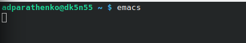{ #fig:001 width=70% }

## Создаём файл lab07.sh с помощью комбинации Ctrl-x Ctrl-f

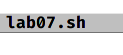{ #fig:002 width=70% }

## Набираем данный текст 

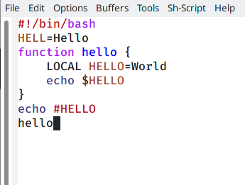{ #fig:003 width=70% }

### Сохраняем файл с помощью комбинации Ctrl-x Ctrl-s 

## Проделать с текстом стандартные процедуры редактирования 

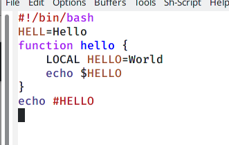{ #fig:004 width=70% }

## Проделать с текстом стандартные процедуры редактирования 

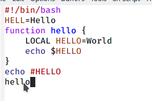{ #fig:005 width=70% }

## Проделать с текстом стандартные процедуры редактирования 

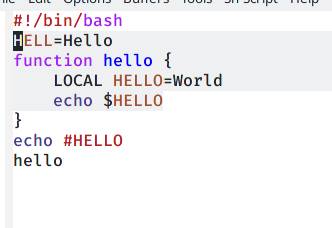{ #fig:006 width=70% }

## Проделать с текстом стандартные процедуры редактирования 

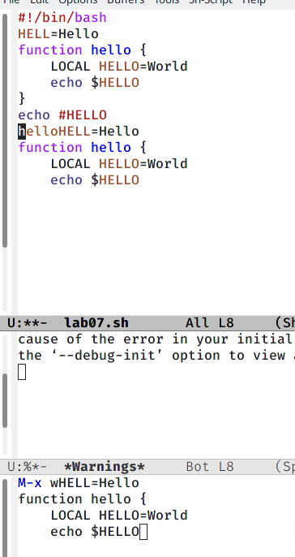{ #fig:007 width=70% }

## Проделать с текстом стандартные процедуры редактирования 

{ #fig:008 width=70% }

## Проделать с текстом стандартные процедуры редактирования 

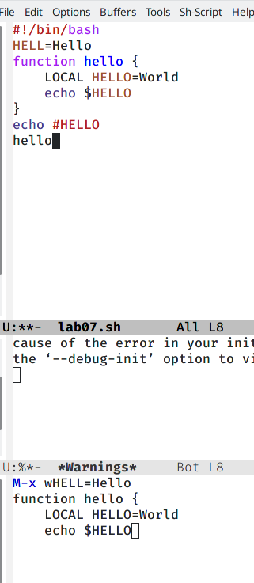{ #fig:009 width=70% }

## Проделать с текстом стандартные процедуры редактирования 

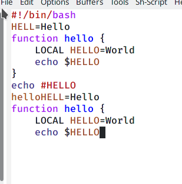{ #fig:010 width=70% }

## Выполняем команды по перемещению курсора 

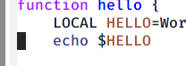{ #fig:011 width=70% }

## Выполняем команды по перемещению курсора 

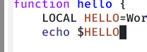{ #fig:012 width=70% }

## Совершаем управление буферами 

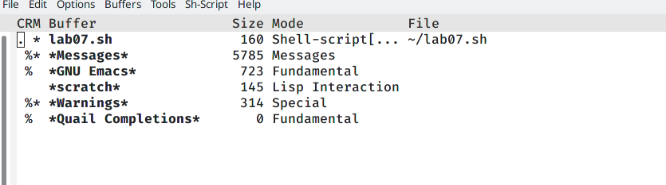{ #fig:013 width=70% }

## Совершаем управление буферами 

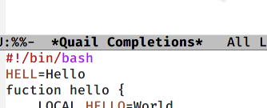{ #fig:014 width=70% }

## Совершаем управление буферами 

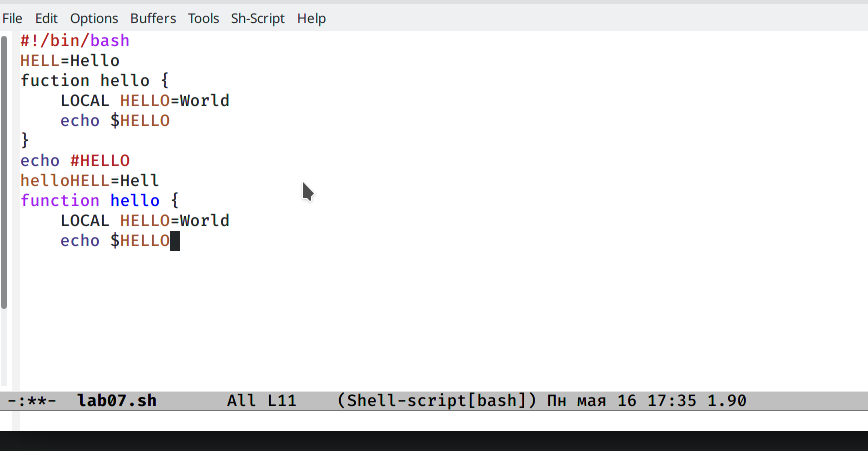{ #fig:015 width=70% }

## Совершаем управление буферами 

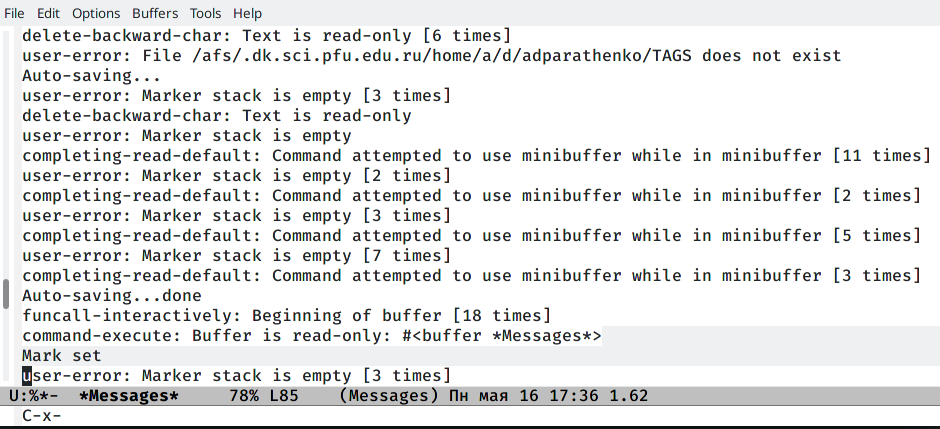{ #fig:016 width=70% }

## Управление окнами 

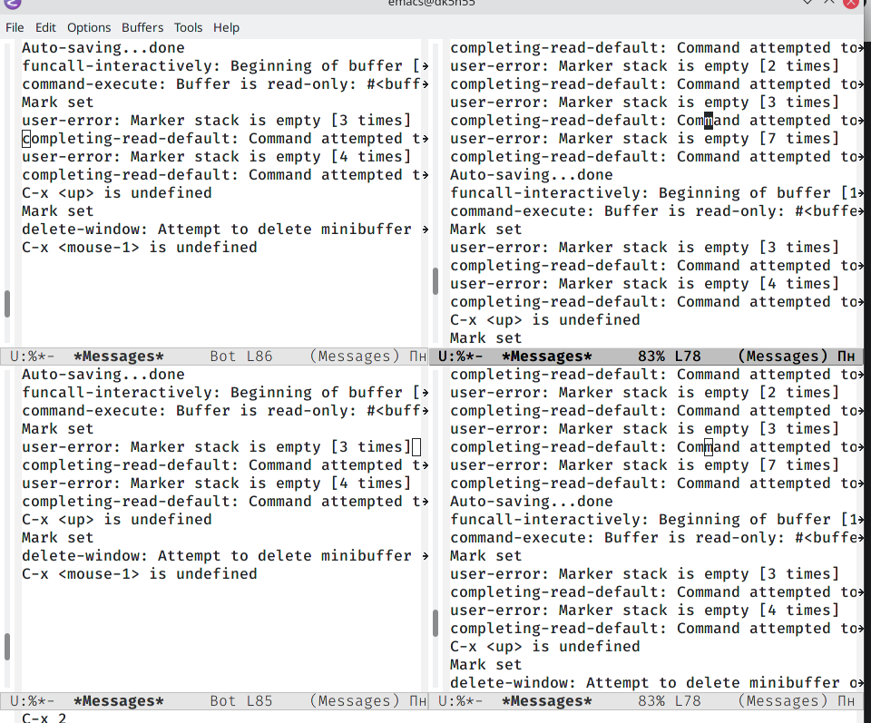{ #fig:017 width=70% }

## Управление окнами 

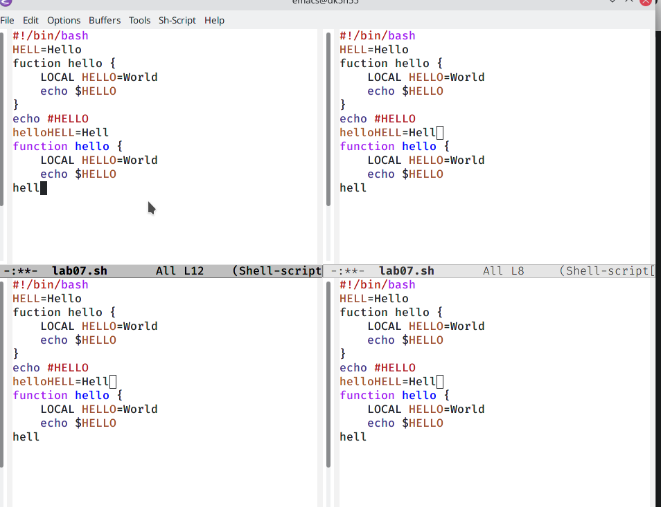{ #fig:018 width=70% }

## Режим поиска 

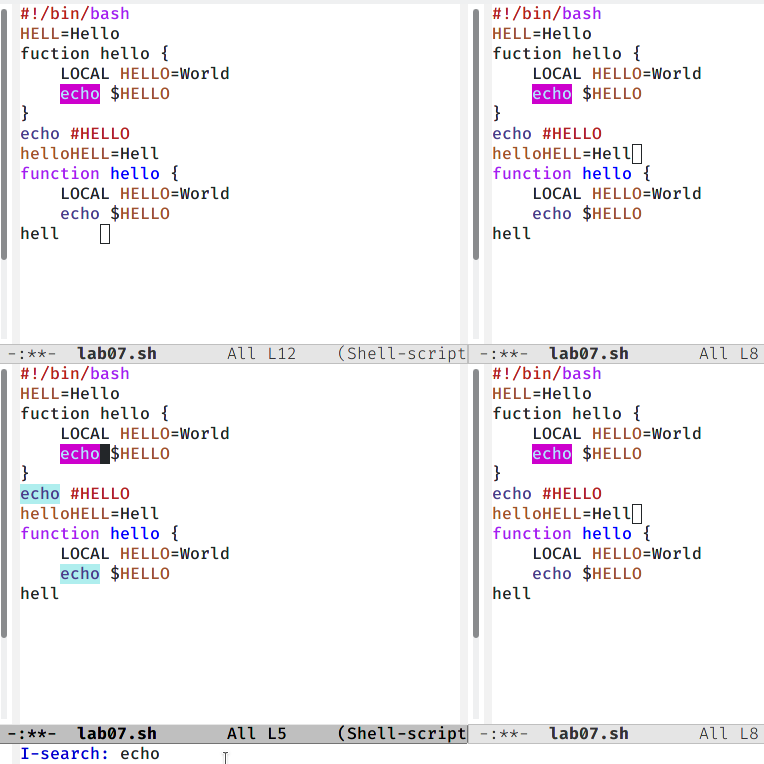{ #fig:019 width=70% }

## Режим поиска 

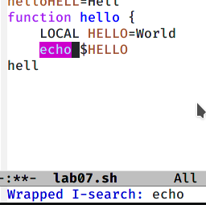{ #fig:020 width=70% }

## Режим поиска 

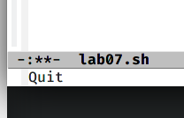{ #fig:021 width=70% }

# Вывод

Познакомилась с операционной системой Linux. Получила практические навыки работы с редактором Emacs.