---
## Front matter
lang: ru-RU
title: Презентация по лабораторной работе №10
author: |
	Паращенко Антонина
institute: |
	РУДН, Москва, Россия

date: 28 апреля 2022

## Formatting
toc: false
slide_level: 2
theme: metropolis
header-includes: 
 - \metroset{progressbar=frametitle,sectionpage=progressbar,numbering=fraction}
 - '\makeatletter'
 - '\beamer@ignorenonframefalse'
 - '\makeatother'
aspectratio: 43
section-titles: true
---

# Цель работы

Изучить основы программирования в оболочке ОС UNIX/Linux. Научиться писать небольшие командные файлы.

# Ход лабораторной работы
## Задание 1
1) Изучаем команды архивирования с помощью команды man (рис. [-@fig:001]) - (рис. [-@fig:004])

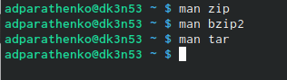{ #fig:001 width=70% }

## Задание 1

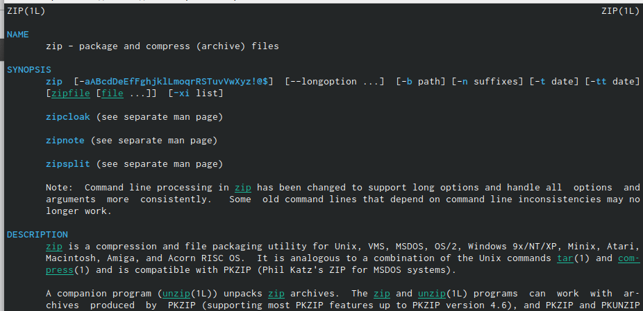{ #fig:002 width=70% }

## Задание 1

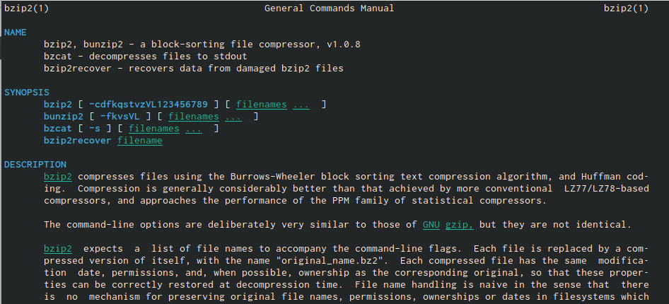{ #fig:003 width=70% }

## Задание 1

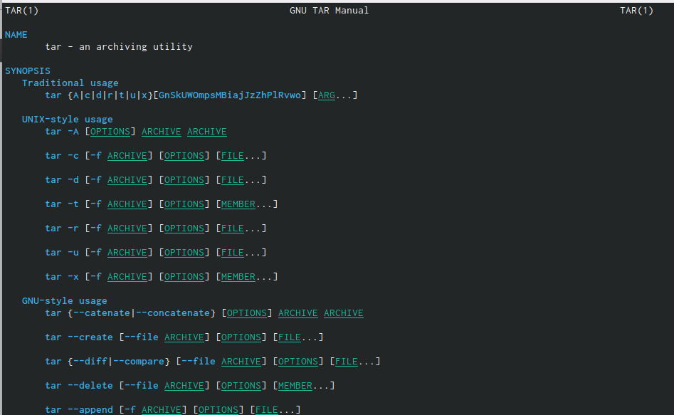{ #fig:004 width=70% }

## Задание 1

2) Создаём файл backup.sh и открываем его в редакторе emacs. Пишем скрипт кода. Меняем права доступа к файлу с помощью команды chmod. Запускаем файл backup.sh (рис. [-@fig:005]) - (рис. [-@fig:006])

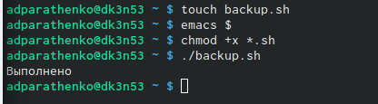{ #fig:005 width=50% }

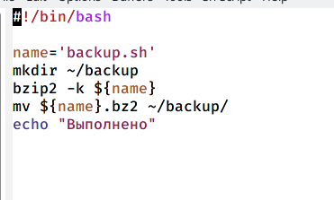{ #fig:006 width=40% }

## Задание 2

1) Создаём файл prog2.sh и открываем его в редакторе emacs. Пишем скрипт кода. Меняем права доступа к файлу с помощью команды chmod. Запускаем файл prog2.sh c некоторыми аргументами (рис. [-@fig:007]) - (рис. [-@fig:008])

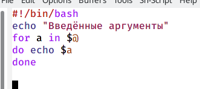{ #fig:007 width=50% }

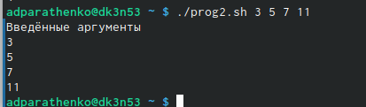{ #fig:008 width=50% }

## Задание 3

1) Создаём файл progls.sh и открываем его в редакторе emacs. Пишем скрипт кода. Меняем права доступа к файлу с помощью команды chmod. Запускаем файл progls.sh c некоторыми аргументами (рис. [-@fig:009]) - (рис. [-@fig:010])

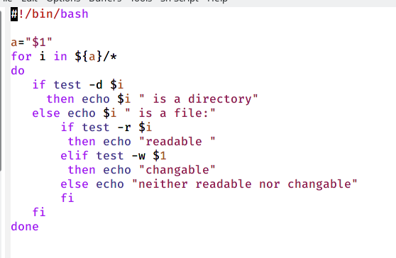{ #fig:009 width=70% }

## Задание 3

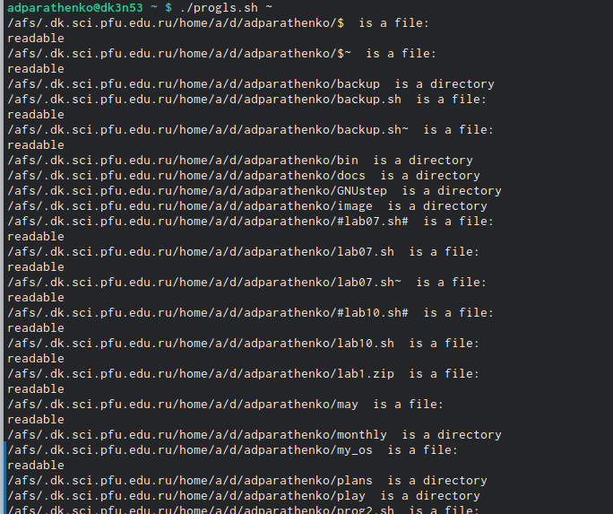{ #fig:010 width=70% }

## Задание 4

1) Создаём файл format.sh и открываем его в редакторе emacs. Пишем скрипт кода. Меняем права доступа к файлу с помощью команды chmod. Запускаем файл format.sh c некоторыми аргументами (рис. [-@fig:011]) - (рис. [-@fig:012]) 

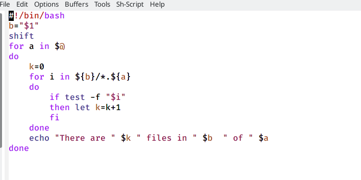{ #fig:011 width=50% }

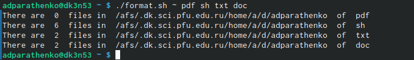{ #fig:012 width=50% }

# Вывод
Изучила основы программирования в оболочке ОС UNIX/Linux, а также научилась писать небольшие командные файлы.
