---
## Front matter
title: "Отчёт по лабораторной работе №10"
author: "Паращенко Антонина Дмитриевна"

## Generic otions
lang: ru-RU
toc-title: "Содержание"

## Bibliography
bibliography: bib/cite.bib
csl: pandoc/csl/gost-r-7-0-5-2008-numeric.csl

## Pdf output format
toc: true # Table of contents
toc-depth: 2
lof: true # List of figures
lot: true # List of tables
fontsize: 12pt
linestretch: 1.5
papersize: a4
documentclass: scrreprt
## I18n polyglossia
polyglossia-lang:
  name: russian
  options:
	- spelling=modern
	- babelshorthands=true
polyglossia-otherlangs:
  name: english
## I18n babel
babel-lang: russian
babel-otherlangs: english
## Fonts
mainfont: PT Serif
romanfont: PT Serif
sansfont: PT Sans
monofont: PT Mono
mainfontoptions: Ligatures=TeX
romanfontoptions: Ligatures=TeX
sansfontoptions: Ligatures=TeX,Scale=MatchLowercase
monofontoptions: Scale=MatchLowercase,Scale=0.9
## Biblatex
biblatex: true
biblio-style: "gost-numeric"
biblatexoptions:
  - parentracker=true
  - backend=biber
  - hyperref=auto
  - language=auto
  - autolang=other*
  - citestyle=gost-numeric
## Pandoc-crossref LaTeX customization
figureTitle: "Рис."
tableTitle: "Таблица"
listingTitle: "Листинг"
lofTitle: "Список иллюстраций"
lotTitle: "Список таблиц"
lolTitle: "Листинги"
## Misc options
indent: true
header-includes:
  - \usepackage{indentfirst}
  - \usepackage{float} # keep figures where there are in the text
  - \floatplacement{figure}{H} # keep figures where there are in the text
---

# Цель работы

Изучить основы программирования в оболочке ОС UNIX/Linux. Научиться писать небольшие командные файлы.

# Ход лабораторной работы
## Задание 1
1) Изучаем команды архивирования с помощью команды man (рис. [-@fig:001]) - (рис. [-@fig:004])

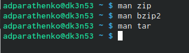{ #fig:001 width=70% }

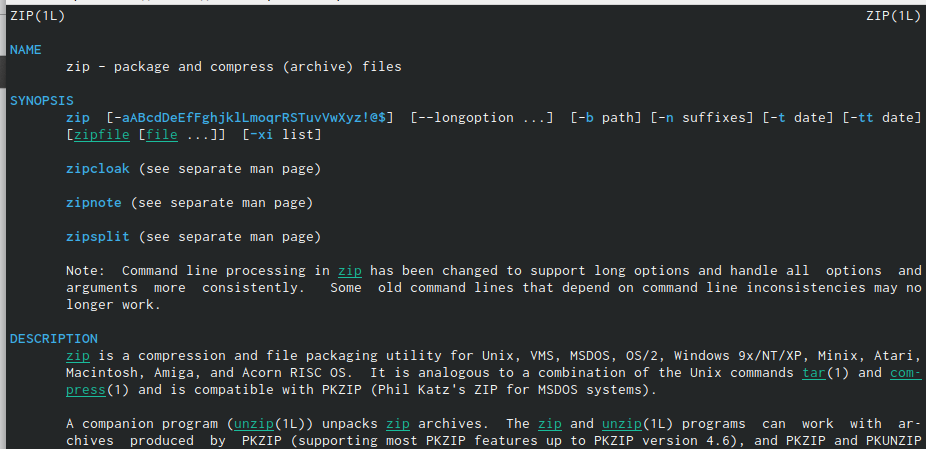{ #fig:002 width=70% }

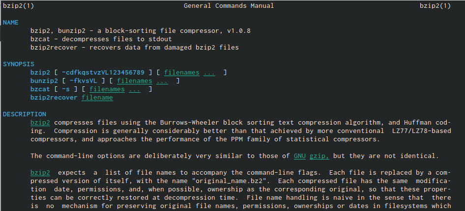{ #fig:003 width=70% }

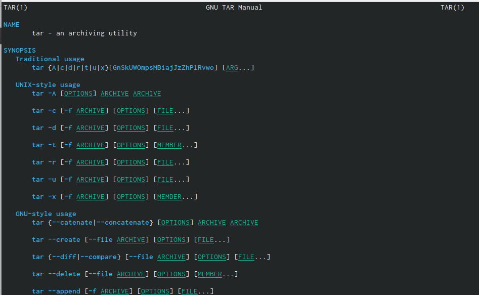{ #fig:004 width=70% }

2) Создаём файл backup.sh и открываем его в редакторе emacs. Пишем скрипт кода. Меняем права доступа к файлу с помощью команды chmod. Запускаем файл backup.sh (рис. [-@fig:005]) - (рис. [-@fig:006])

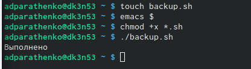{ #fig:005 width=70% }

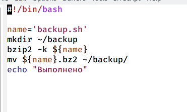{ #fig:006 width=70% }

## Задание 2

1) Создаём файл prog2.sh и открываем его в редакторе emacs. Пишем скрипт кода. Меняем права доступа к файлу с помощью команды chmod. Запускаем файл prog2.sh c некоторыми аргументами (рис. [-@fig:007]) - (рис. [-@fig:008])

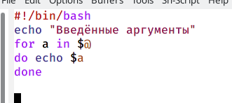{ #fig:007 width=70% }

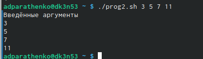{ #fig:008 width=70% }

## Задание 3

1) Создаём файл progls.sh и открываем его в редакторе emacs. Пишем скрипт кода. Меняем права доступа к файлу с помощью команды chmod. Запускаем файл progls.sh c некоторыми аргументами (рис. [-@fig:009]) - (рис. [-@fig:010])

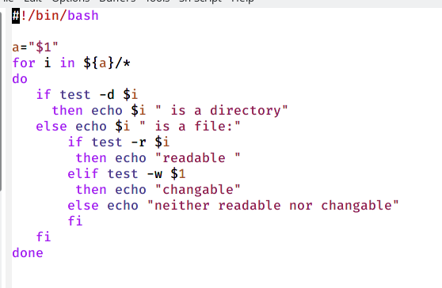{ #fig:009 width=70% }

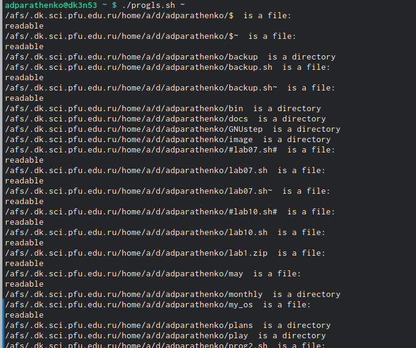{ #fig:010 width=70% }

## Задание 4

1) Создаём файл format.sh и открываем его в редакторе emacs. Пишем скрипт кода. Меняем права доступа к файлу с помощью команды chmod. Запускаем файл format.sh c некоторыми аргументами (рис. [-@fig:011]) - (рис. [-@fig:012]) 

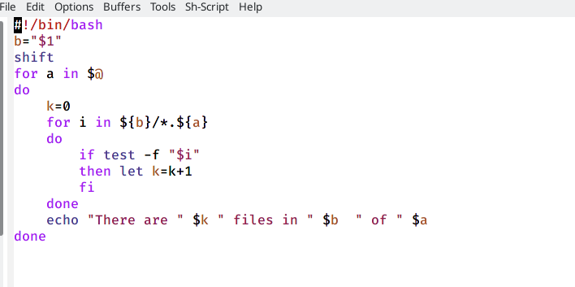{ #fig:011 width=70% }

{ #fig:012 width=70% }

# Вывод
Изучила основы программирования в оболочке ОС UNIX/Linux, а также научилась писать небольшие командные файлы.
