---
## Front matter
lang: ru-RU
title: Презентация по лабораторной работе №11
author: |
	Паращенко Антонина
institute: |
	РУДН, Москва, Россия

date: 28 апреля 2022

## Formatting
toc: false
slide_level: 2
theme: metropolis
header-includes: 
 - \metroset{progressbar=frametitle,sectionpage=progressbar,numbering=fraction}
 - '\makeatletter'
 - '\beamer@ignorenonframefalse'
 - '\makeatother'
aspectratio: 43
section-titles: true
---

# Цель работы

Изучить основы программирования в оболочке ОС UNIX. Научится писать болеесложные командные файлы с использованием логических управляющих конструкцийи циклов

# Ход лабораторной работы
## Задание 1
Используя командыgetopts grep,написать командный файл,который анализируеткомандную строку с ключами (рис. [-@fig:001]) - (рис. [-@fig:004])

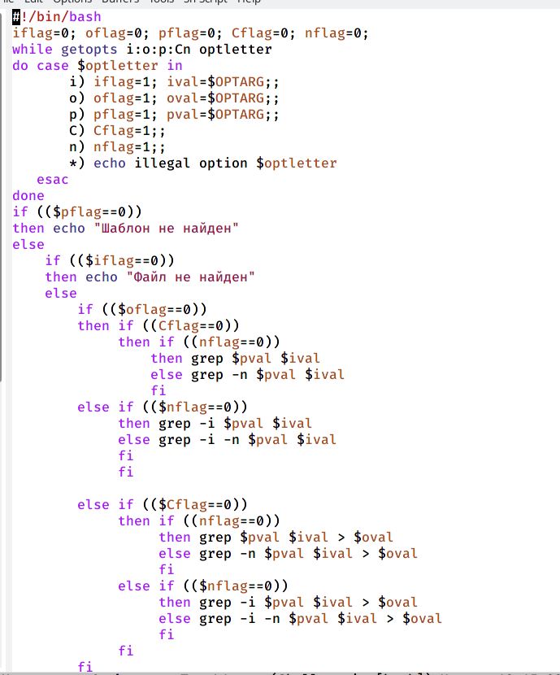{ #fig:001 width=40% }

## Задание 1

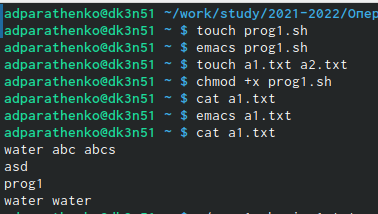{ #fig:002 width=70% }

## Задание 1

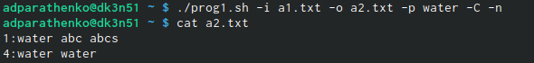{ #fig:003 width=90% }

## Задание 1

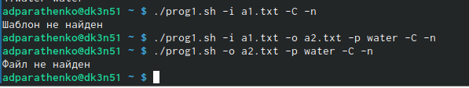{ #fig:004 width=70% }

## Задание 2
Написать на языке Си программу (рис. [-@fig:005]) - (рис. [-@fig:008])

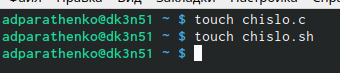{ #fig:005 width=70% }

## Задание 2

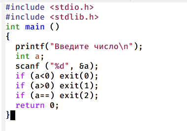{ #fig:006 width=70% }

## Задание 2

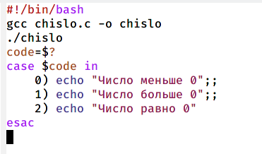{ #fig:007 width=70% }

## Задание 2

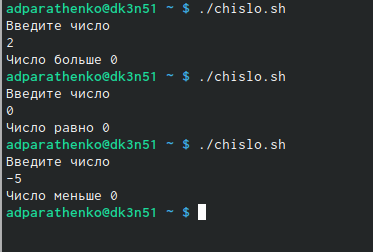{ #fig:008 width=70% }

## Задание 3
Написать командный файл,создающий указанное число файлов,пронумерованных последовательно от 1 до N (рис. [-@fig:009]) - (рис. [-@fig:011])

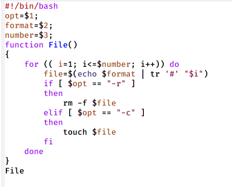{ #fig:009 width=70% }

## Задание 3

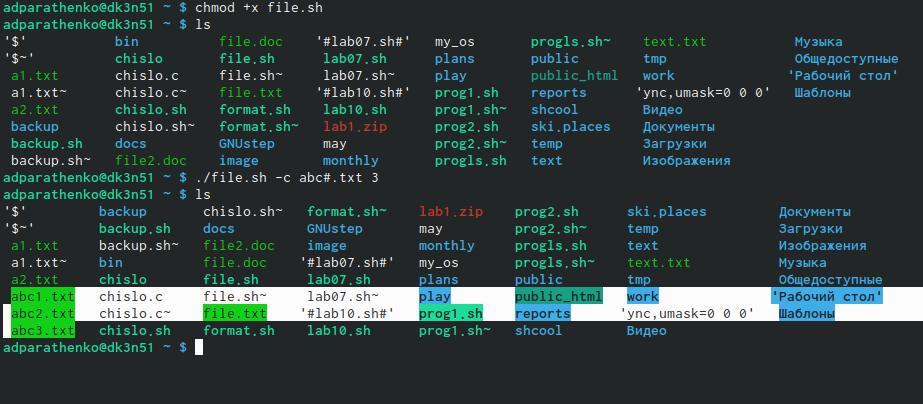{ #fig:010 width=70% }

## Задание 3

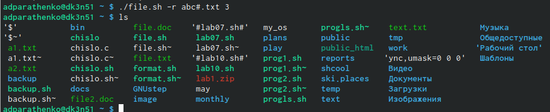{ #fig:011 width=70% }

## Задание 4
Написать командный файл,который с помощью команды tar запаковывает в архив все файлы в указанной директории (рис. [-@fig:012]) - (рис. [-@fig:013])

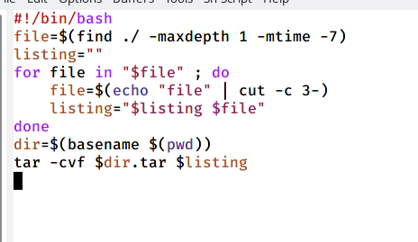{ #fig:012 width=70% }

## Задание 4

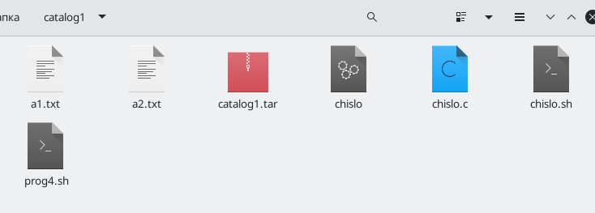{ #fig:013 width=70% }

# Вывод
Изучила основы программирования в оболочке ОС UNIX. Научилась писать болеесложные командные файлы с использованием логических управляющих конструкцийи циклов
