---
## Front matter
lang: ru-RU
title: Презентация по лабораторной работе №12
author: |
	Паращенко Антонина
institute: |
	РУДН, Москва, Россия

date: 28 апреля 2022

## Formatting
toc: false
slide_level: 2
theme: metropolis
header-includes: 
 - \metroset{progressbar=frametitle,sectionpage=progressbar,numbering=fraction}
 - '\makeatletter'
 - '\beamer@ignorenonframefalse'
 - '\makeatother'
aspectratio: 43
section-titles: true
---

# Цель работы

Изучить основы программирования в оболочке ОС UNIX. Научиться писать более сложные командные файлы с использованием логических управляющих конструкций и циклов.

# Ход лабораторной работы
## Задание 1
Написать командный файл, реализующий упрощённый механизм семафоров 
1) Создаём файл senafor.sh и открываем его в редакторе emacs (рис. [-@fig:001])

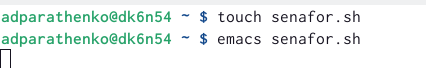{ #fig:001 width=70% }

## Задание 1
2) Пишем скрипт командного файла (рис. [-@fig:002])
 
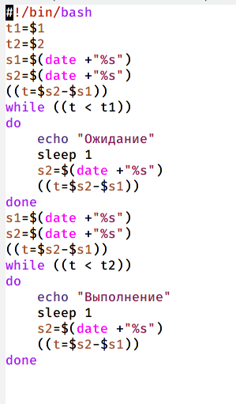{ #fig:002 width=30% }

## Задание 1
3) Даём права на исполнение файла и запускаем командный файл (рис. [-@fig:003])

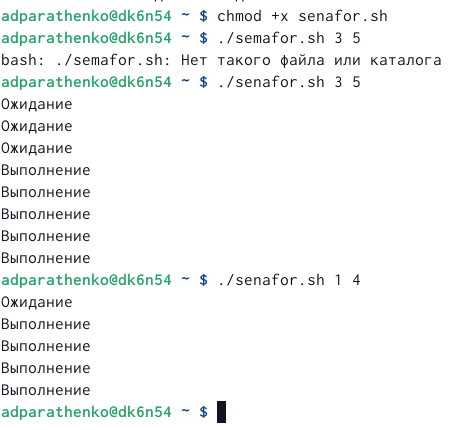{ #fig:003 width=60% }

## Задание 1
4) Дорабатываем программу так, чтобы имелась возможность взаимодействия трёх и более процессов. (рис. [-@fig:004])

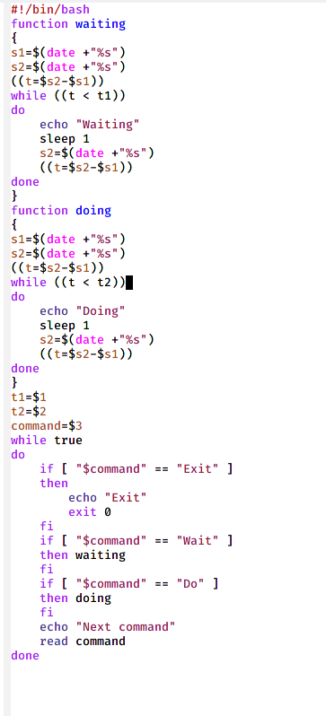{ #fig:004 width=25% }

## Задание 1
5) Запускаем программу (рис. [-@fig:005])

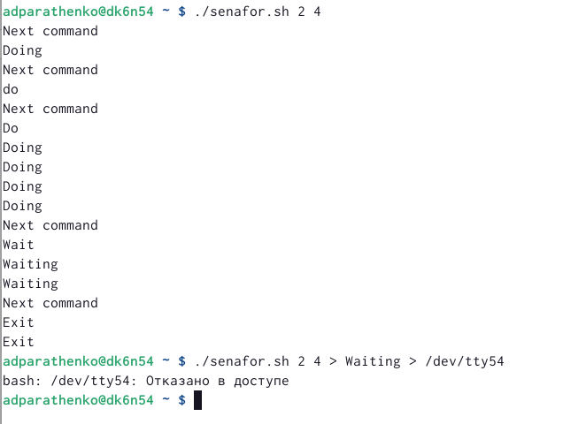{ #fig:005 width=70% }

## Задание 2
Реализовать команду man с помощью командного файла.
1) Изучаем содержимое каталога /usr/share/man/man1. (рис. [-@fig:006])

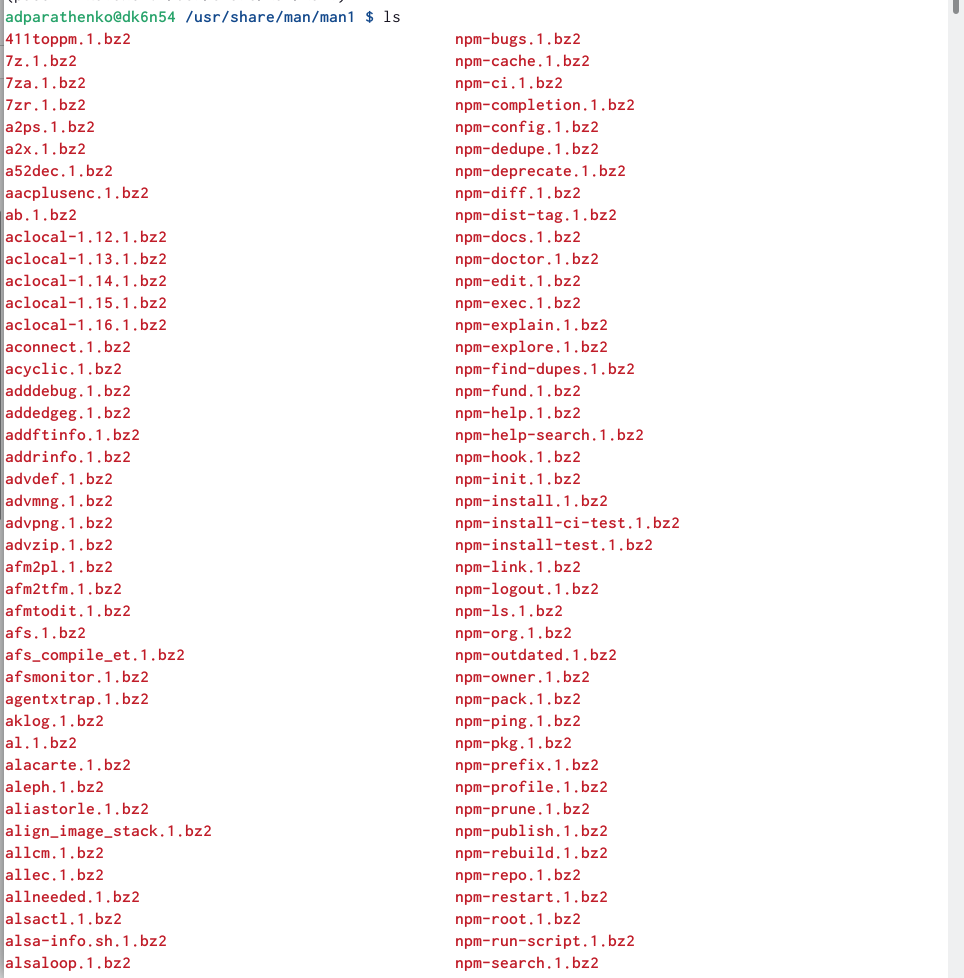{ #fig:006 width=50% }

## Задание 2
2) Создаём файл man.sh и открываем его в редакторе emacs. Пишем скрипт командного файла (рис. [-@fig:007])

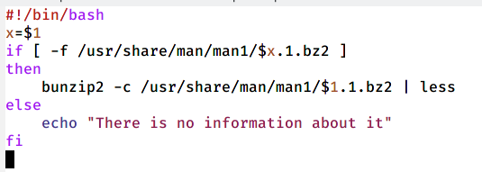{ #fig:007 width=70% }

## Задание 2
3) Даём право на исполнение и проверяем работу командного файла с командами mkdir и ls (рис. [-@fig:008]) - (рис. [-@fig:011])

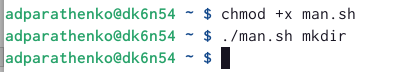{ #fig:008 width=70% }

## Даём право на исполнение и проверяем работу командного файла с командами mkdir и ls

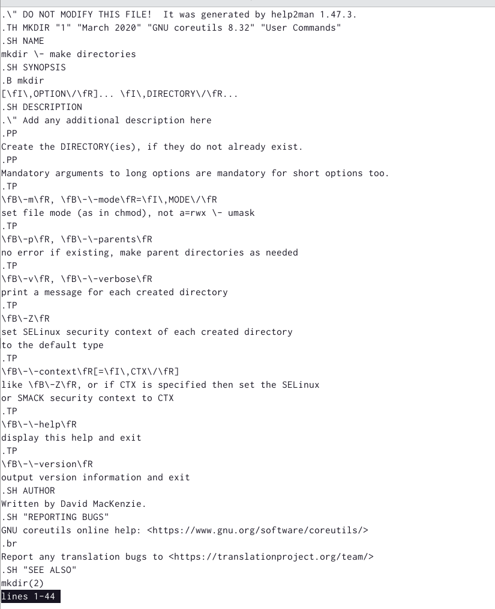{ #fig:009 width=50% }

## Даём право на исполнение и проверяем работу командного файла с командами mkdir и ls

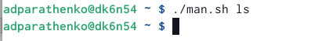{ #fig:010 width=70% }

## Даём право на исполнение и проверяем работу командного файла с командами mkdir и ls

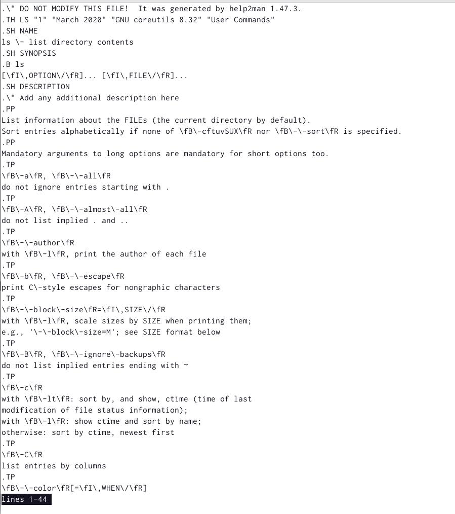{ #fig:011 width=50% }

## Задание 2
4) Проверяем работу файла с несуществующей командой rted (рис. [-@fig:012])

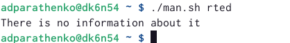{ #fig:012 width=70% }

## Задание 3
Используя встроенную переменную $RANDOM, напишите командный файл, генерирующий случайную последовательность букв латинского алфавита.
1) Создаём файл man.sh и открываем его в редакторе emacs. Пишем скрипт командного файла (рис. [-@fig:013])

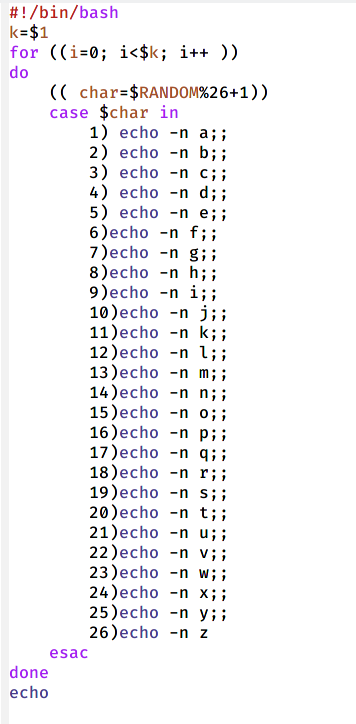{ #fig:013 width=23% }

## Задание 3
2) Запускаем файл и проверяем провильность работы (рис. [-@fig:014])

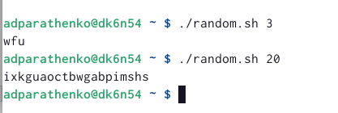{ #fig:014 width=70% }

# Вывод
Изучила основы программирования в оболочке ОС UNIX. Научилась писать более сложные командные файлы с использованием логических управляющих конструкций и циклов.
