---
## Front matter
title: "Отчёт по лабораторной работе №12"
author: "Паращенко Антонина Дмитриевна"

## Generic otions
lang: ru-RU
toc-title: "Содержание"

## Bibliography
bibliography: bib/cite.bib
csl: pandoc/csl/gost-r-7-0-5-2008-numeric.csl

## Pdf output format
toc: true # Table of contents
toc-depth: 2
lof: true # List of figures
lot: true # List of tables
fontsize: 12pt
linestretch: 1.5
papersize: a4
documentclass: scrreprt
## I18n polyglossia
polyglossia-lang:
  name: russian
  options:
	- spelling=modern
	- babelshorthands=true
polyglossia-otherlangs:
  name: english
## I18n babel
babel-lang: russian
babel-otherlangs: english
## Fonts
mainfont: PT Serif
romanfont: PT Serif
sansfont: PT Sans
monofont: PT Mono
mainfontoptions: Ligatures=TeX
romanfontoptions: Ligatures=TeX
sansfontoptions: Ligatures=TeX,Scale=MatchLowercase
monofontoptions: Scale=MatchLowercase,Scale=0.9
## Biblatex
biblatex: true
biblio-style: "gost-numeric"
biblatexoptions:
  - parentracker=true
  - backend=biber
  - hyperref=auto
  - language=auto
  - autolang=other*
  - citestyle=gost-numeric
## Pandoc-crossref LaTeX customization
figureTitle: "Рис."
tableTitle: "Таблица"
listingTitle: "Листинг"
lofTitle: "Список иллюстраций"
lotTitle: "Список таблиц"
lolTitle: "Листинги"
## Misc options
indent: true
header-includes:
  - \usepackage{indentfirst}
  - \usepackage{float} # keep figures where there are in the text
  - \floatplacement{figure}{H} # keep figures where there are in the text
---

# Цель работы

Изучить основы программирования в оболочке ОС UNIX. Научиться писать более сложные командные файлы с использованием логических управляющих конструкций и циклов.

# Ход лабораторной работы
## Задание 1
Написать командный файл, реализующий упрощённый механизм семафоров 
1) Создаём файл senafor.sh и открываем его в редакторе emacs (рис. [-@fig:001])

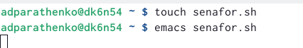{ #fig:001 width=70% }

2) Пишем скрипт командного файла (рис. [-@fig:002])
 
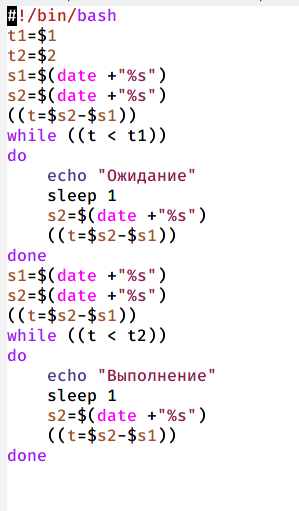{ #fig:002 width=70% }

3) Даём права на исполнение файла и запускаем командный файл (рис. [-@fig:003])

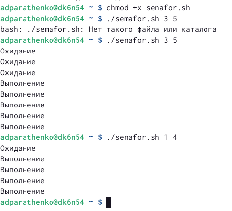{ #fig:003 width=70% }

4) Дорабатываем программу так, чтобы имелась возможность взаимодействия трёх и более процессов. (рис. [-@fig:004])

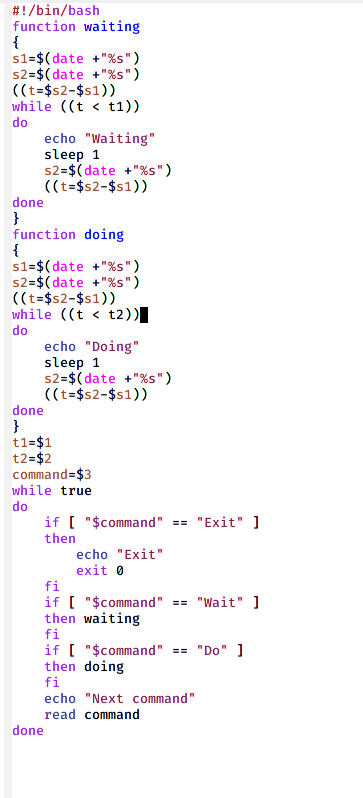{ #fig:004 width=70% }

5) Запускаем программу (рис. [-@fig:005])

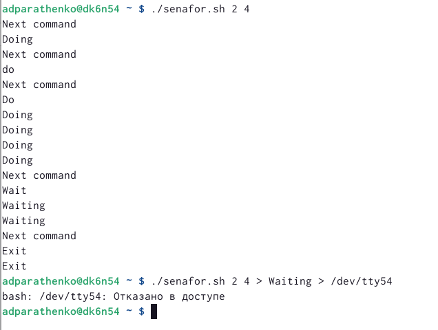{ #fig:005 width=70% }

## Задание 2
Реализовать команду man с помощью командного файла.
1) Изучаем содержимое каталога /usr/share/man/man1. (рис. [-@fig:006])

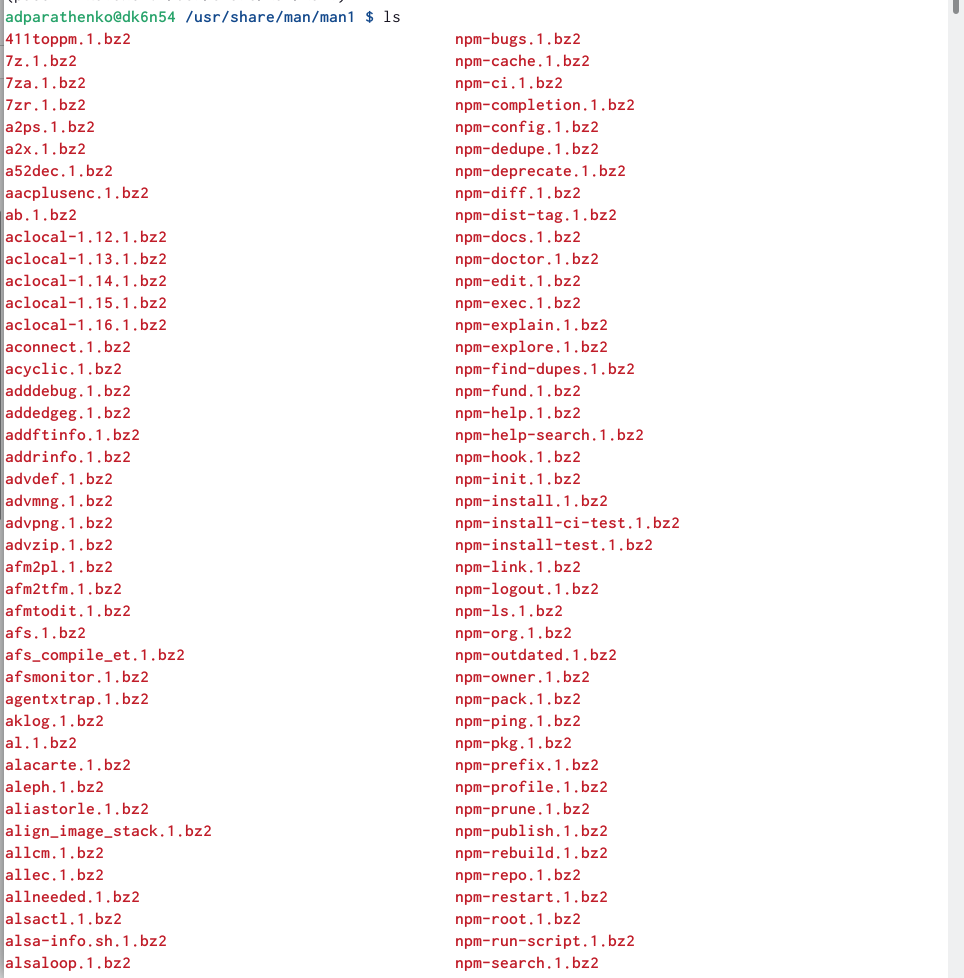{ #fig:006 width=70% }

2) Создаём файл man.sh и открываем его в редакторе emacs. Пишем скрипт командного файла (рис. [-@fig:007])

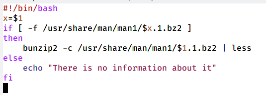{ #fig:007 width=70% }

3) Даём право на исполнение и проверяем работу командного файла с командами mkdir и ls (рис. [-@fig:008]) - (рис. [-@fig:011])

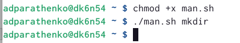{ #fig:008 width=70% }

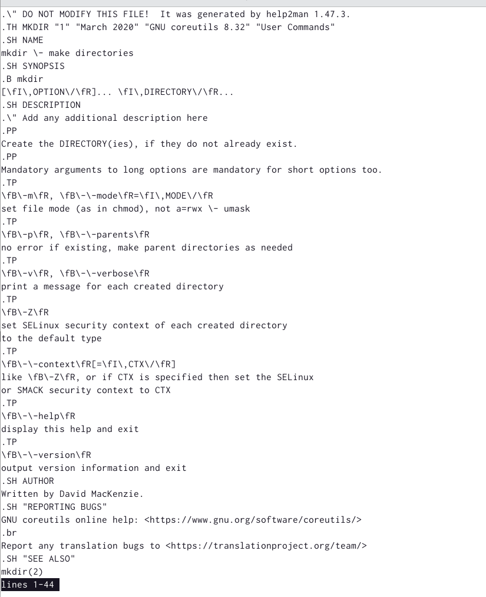{ #fig:009 width=70% }

{ #fig:010 width=70% }

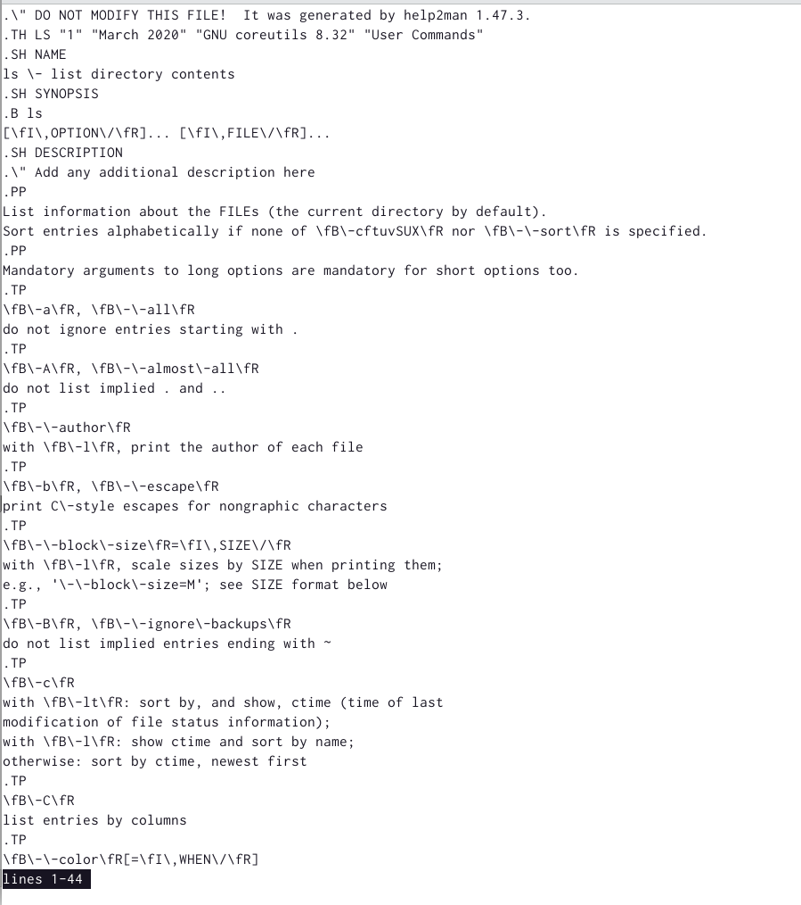{ #fig:011 width=70% }

4) Проверяем работу файла с несуществующей командой rted (рис. [-@fig:012])

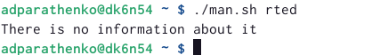{ #fig:012 width=70% }

## Задание 3
Используя встроенную переменную $RANDOM, напишите командный файл, генерирующий случайную последовательность букв латинского алфавита.
1) Создаём файл man.sh и открываем его в редакторе emacs. Пишем скрипт командного файла (рис. [-@fig:013])

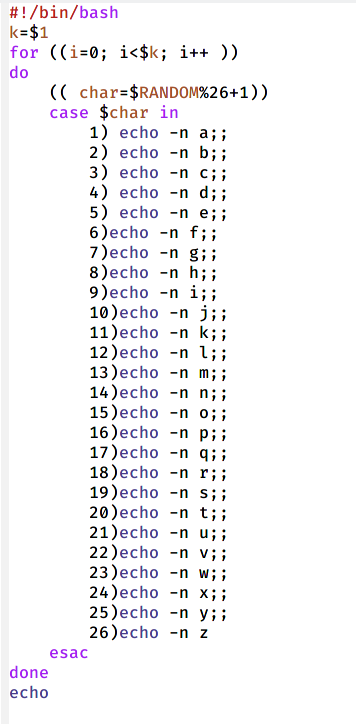{ #fig:013 width=70% }

2) Запускаем файл и проверяем провильность работы (рис. [-@fig:014])

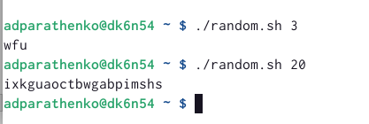{ #fig:014 width=70% }

# Вывод
Изучила основы программирования в оболочке ОС UNIX. Научилась писать более сложные командные файлы с использованием логических управляющих конструкций и циклов.
