---
## Front matter
lang: ru-RU
title: Презентация по лабораторной работе №13
author: |
	Паращенко Антонина
institute: |
	РУДН, Москва, Россия

date: 28 апреля 2022

## Formatting
toc: false
slide_level: 2
theme: metropolis
header-includes: 
 - \metroset{progressbar=frametitle,sectionpage=progressbar,numbering=fraction}
 - '\makeatletter'
 - '\beamer@ignorenonframefalse'
 - '\makeatother'
aspectratio: 43
section-titles: true
---

# Цель работы

Приобрести простейшие навыки разработки,анализа,тестирования и отладки при-ложений в ОС типа UNIX/Linux на примере создания на языке программированияС калькулятора с простейшими функциями.

# Ход лабораторной работы
## В домашнем каталоге создаём подкаталог ~/work/os/lab_prog и создаём в нём файлы: calculate.h,calculate.c,main.c

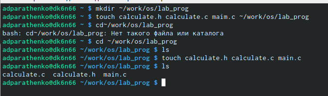{ #fig:001 width=70% }

## Пишем скрипт файла calculate.c 
 
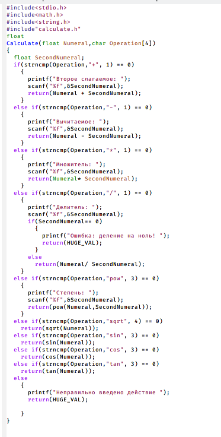{ #fig:002 width=30% }

## Пишем скрипт файла calculate.h 

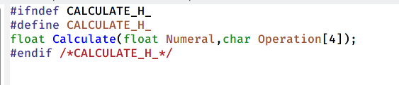{ #fig:003 width=70% }

## Пишем скрипт файла main.c 

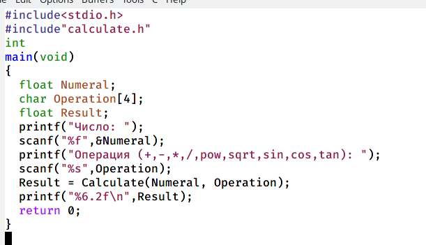{ #fig:004 width=50% }

## Выполняем компиляцию программы посредством gcc, исправляем ошибки и компилируем снова 

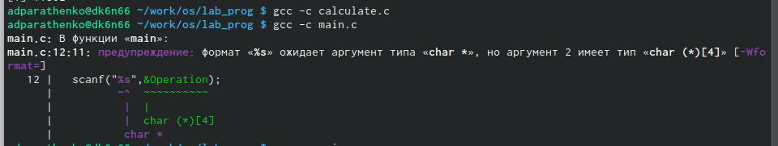{ #fig:005 width=70% }

## Выполняем компиляцию программы посредством gcc, исправляем ошибки и компилируем снова 

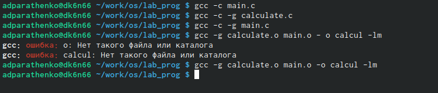{ #fig:006 width=70% }

## Создаём Makefile, который выполняет компиляцию программы посредством gcc вместо ручного ввода. 

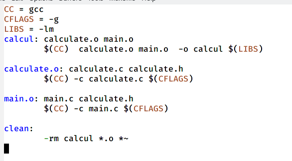{ #fig:007 width=70% }

## Запускаем отладчик GDB,загрузив в него программу для отладки.

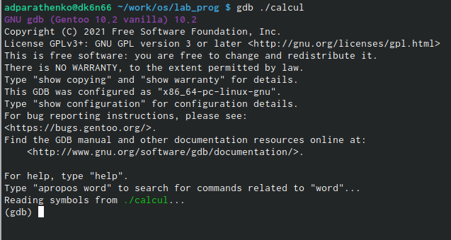{ #fig:008 width=70% }

## Запускаем программу внутри отладчика с помощью команды run (рис. [-@fig:009])

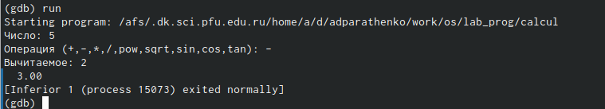{ #fig:009 width=70% }

## Для просмотра исходного код используем команду list. 

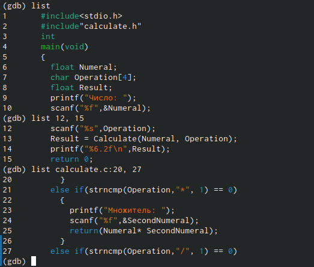{ #fig:010 width=70% }

## Устанавливаем точку останова

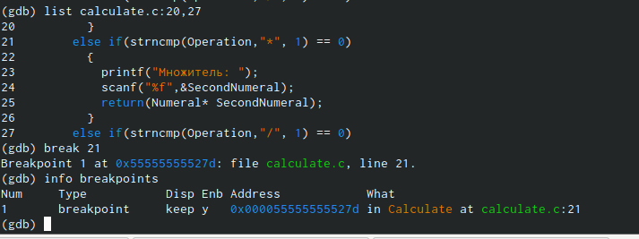{ #fig:011 width=70% }

## С помощью команды backtrace смотрим весь стек вызываемых функций 

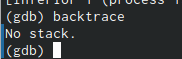{ #fig:012 width=70% }

## С помощью утилиты splint анализируем коды файлов 

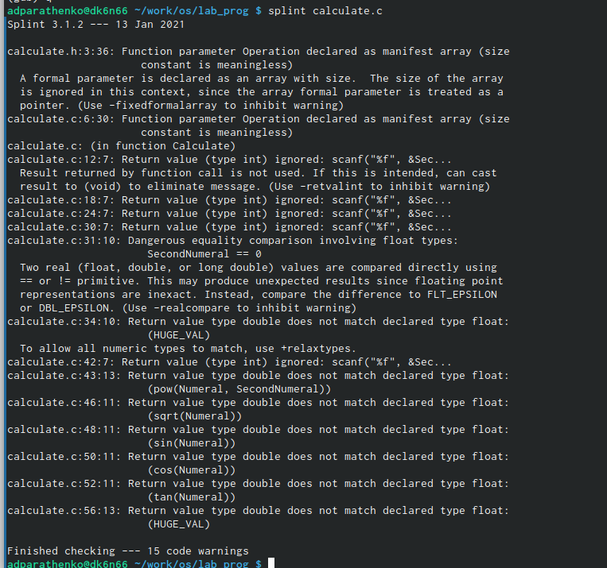{ #fig:013 width=70% }

## С помощью утилиты splint анализируем коды файлов 

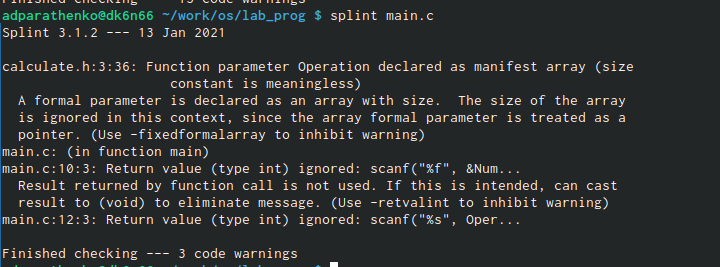{ #fig:014 width=70% }

## Вывод
Приобрела простейшие навыки разработки, анализа, тестирования и отладки приложений в ОС типа UNIX/Linux на примере создания на языке программирования С калькулятора с простейшими функциями.

