---
## Front matter
title: "Отчёт по лабораторной работе №13"
author: "Паращенко Антонина Дмитриевна"

## Generic otions
lang: ru-RU
toc-title: "Содержание"

## Bibliography
bibliography: bib/cite.bib
csl: pandoc/csl/gost-r-7-0-5-2008-numeric.csl

## Pdf output format
toc: true # Table of contents
toc-depth: 2
lof: true # List of figures
lot: true # List of tables
fontsize: 12pt
linestretch: 1.5
papersize: a4
documentclass: scrreprt
## I18n polyglossia
polyglossia-lang:
  name: russian
  options:
	- spelling=modern
	- babelshorthands=true
polyglossia-otherlangs:
  name: english
## I18n babel
babel-lang: russian
babel-otherlangs: english
## Fonts
mainfont: PT Serif
romanfont: PT Serif
sansfont: PT Sans
monofont: PT Mono
mainfontoptions: Ligatures=TeX
romanfontoptions: Ligatures=TeX
sansfontoptions: Ligatures=TeX,Scale=MatchLowercase
monofontoptions: Scale=MatchLowercase,Scale=0.9
## Biblatex
biblatex: true
biblio-style: "gost-numeric"
biblatexoptions:
  - parentracker=true
  - backend=biber
  - hyperref=auto
  - language=auto
  - autolang=other*
  - citestyle=gost-numeric
## Pandoc-crossref LaTeX customization
figureTitle: "Рис."
tableTitle: "Таблица"
listingTitle: "Листинг"
lofTitle: "Список иллюстраций"
lotTitle: "Список таблиц"
lolTitle: "Листинги"
## Misc options
indent: true
header-includes:
  - \usepackage{indentfirst}
  - \usepackage{float} # keep figures where there are in the text
  - \floatplacement{figure}{H} # keep figures where there are in the text
---

# Цель работы

Приобрести простейшие навыки разработки,анализа,тестирования и отладки при-ложений в ОС типа UNIX/Linux на примере создания на языке программированияС калькулятора с простейшими функциями.

# Ход лабораторной работы
1) В домашнем каталоге создаём подкаталог ~/work/os/lab_prog и создаём в нём файлы: calculate.h,calculate.c,main.c (рис. [-@fig:001])

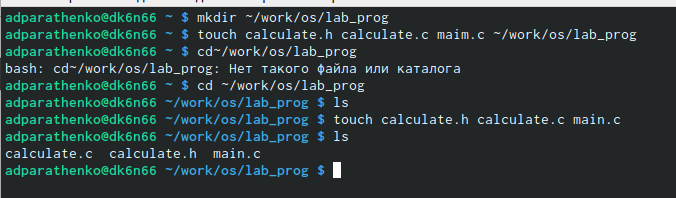{ #fig:001 width=70% }

2) Пишем скрипт файла calculate.c (рис. [-@fig:002])
 
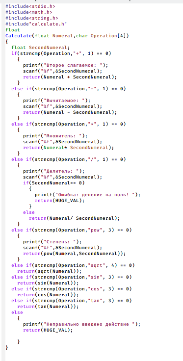{ #fig:002 width=70% }

3) Пишем скрипт файла calculate.h (рис. [-@fig:003])

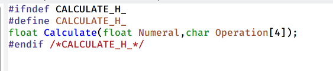{ #fig:003 width=70% }

4) Пишем скрипт файла main.c (рис. [-@fig:004])

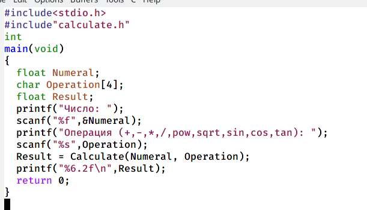{ #fig:004 width=70% }

5) Выполняем компиляцию программы посредством gcc, исправляем ошибки и компилируем снова (рис. [-@fig:005]) - (рис. [-@fig:006])

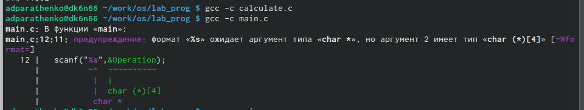{ #fig:005 width=70% }

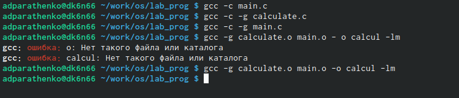{ #fig:006 width=70% }

6) Создайте Makefile, который выполняет компиляцию программы посредством gcc вместо ручного ввода. (рис. [-@fig:007])

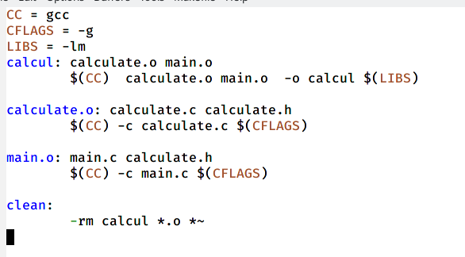{ #fig:007 width=70% }

7) Запустите отладчик GDB,загрузив в него программу для отладки. (рис. [-@fig:008]) 

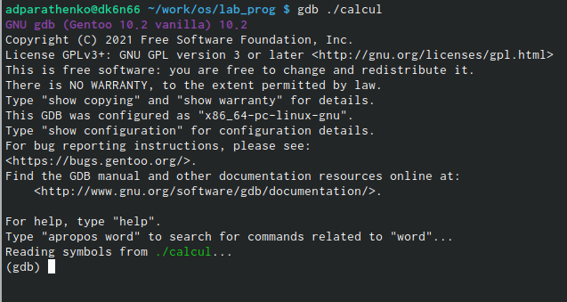{ #fig:008 width=70% }

8) Запускаем программу внутри отладчика с помощью команды run (рис. [-@fig:009])

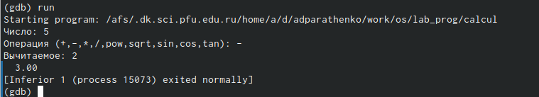{ #fig:009 width=70% }

9) Для постраничного (по 9 строк) просмотра исходного код используем команду list. Для просмотра строк с 12 по 15 основного файла используем list с параметрами. Для просмотра определённых строк не основного файла используйте list с параметрами (рис. [-@fig:010])

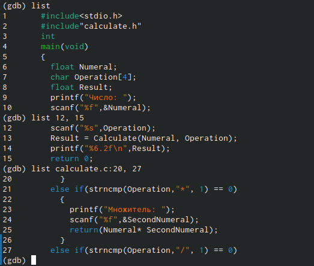{ #fig:010 width=70% }

10) Устанавливаем точку останова в файле calculate.c на строке номер 21. Выводим информацию об имеющихся в проекте точках останова. (рис. [-@fig:011])

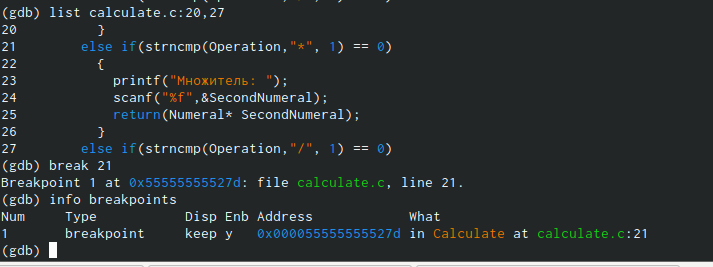{ #fig:011 width=70% }

11) С помощью команды backtrace смотрим весь стек вызываемых функций от начала программы до текущего места (рис. [-@fig:012])

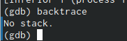{ #fig:012 width=70% }

12) С помощью утилиты splint попробуйте проанализировать коды файлов calculate.c и main.c. (рис. [-@fig:013])

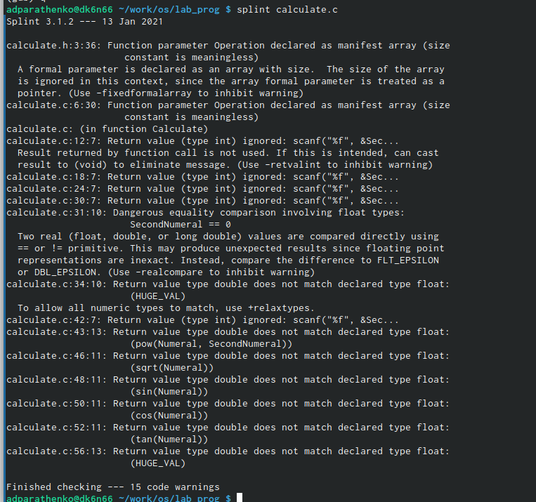{ #fig:013 width=70% }

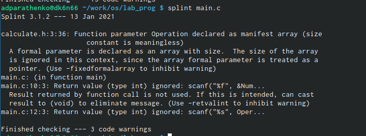{ #fig:014 width=70% }

# Вывод
Приобрела простейшие навыки разработки, анализа, тестирования и отладки приложений в ОС типа UNIX/Linux на примере создания на языке программирования С калькулятора с простейшими функциями.

