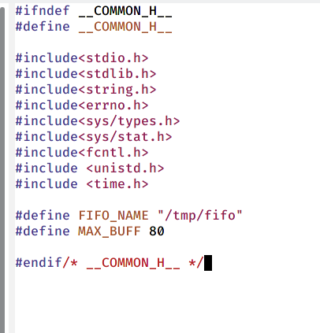

---
## Front matter
lang: ru-RU
title: Презентация по лабораторной работе №14
author: |
	Паращенко Антонина
institute: |
	РУДН, Москва, Россия

date: 28 апреля 2022

## Formatting
toc: false
slide_level: 2
theme: metropolis
header-includes: 
 - \metroset{progressbar=frametitle,sectionpage=progressbar,numbering=fraction}
 - '\makeatletter'
 - '\beamer@ignorenonframefalse'
 - '\makeatother'
aspectratio: 43
section-titles: true
---

# Цель работы

Приобретение практических навыков работы с именованными каналами.

# Ход лабораторной работы
## В домашнем каталоге создаём файлы common.h server.c client.c makefile

{ #fig:001 width=70% }

## Пишем скрипт файла common.h 
 
{ #fig:002 width=60% }

## Пишем скрипт файла server.c 

{ #fig:003 width=35% }

## Пишем скрипт файла client.c 

{ #fig:004 width=50% }

## Пишем скрипт файла makefile 

{ #fig:005 width=70% }

## Скомпилируем файлы с помощью команды make all 

{ #fig:006 width=70% }

## Проверяем работу написанной программы. 

{ #fig:007 width=70% }

## Дополнительный вопрос
Если сервер завершит свою работу, не закрыв канал, то, когда мы будем запускать этот сервер снова, появится ошибка "Невозможно создать FIFO", так как у нас уже есть один канал.

## Вывод
Приобрела практические навыки работы с именованными каналами.
