---
## Front matter
lang: ru-RU
title: Отчёт по первому этапу проекта
author: |
	Паращенко Антонина
institute: |
	РУДН, Москва, Россия

date: 28 апреля 2022

## Formatting
toc: false
slide_level: 2
theme: metropolis
header-includes: 
 - \metroset{progressbar=frametitle,sectionpage=progressbar,numbering=fraction}
 - '\makeatletter'
 - '\beamer@ignorenonframefalse'
 - '\makeatother'
aspectratio: 43
section-titles: true
---

# Цель работы

Добавить к сайту ссылки на научные и библиометрические ресурсы.

# Выполнение лабораторной работы

## Зарегистрация на соответствующих ресурсах 

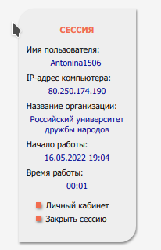{ #fig:001 width=30% }

## Зарегистрация на соответствующих ресурсах 

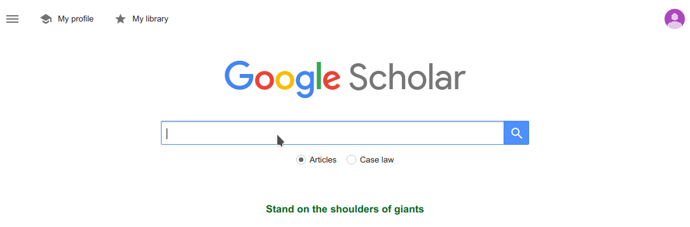{ #fig:002 width=80% }

## Зарегистрация на соответствующих ресурсах 

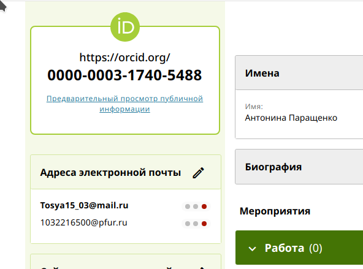{ #fig:003 width=70% }

## Зарегистрация на соответствующих ресурсах 

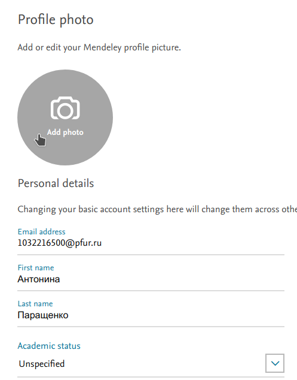{ #fig:004 width=50% }

## Зарегистрация на соответствующих ресурсах 

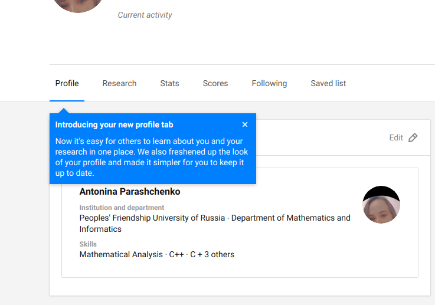{ #fig:005 width=70% }

## Зарегистрация на соответствующих ресурсах 

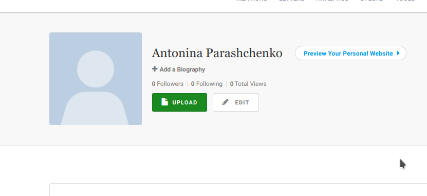{ #fig:006 width=80% }

## Зарегистрация на соответствующих ресурсах 

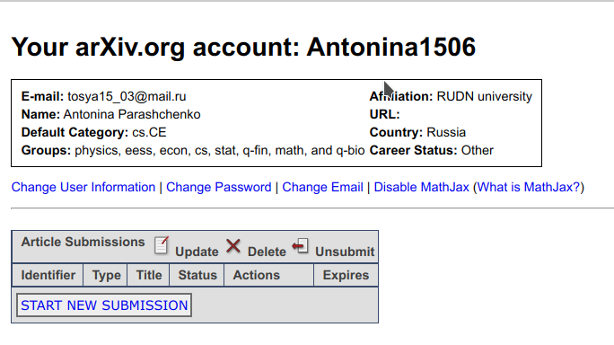{ #fig:007 width=70% }

## Зарегистрация на соответствующих ресурсах 

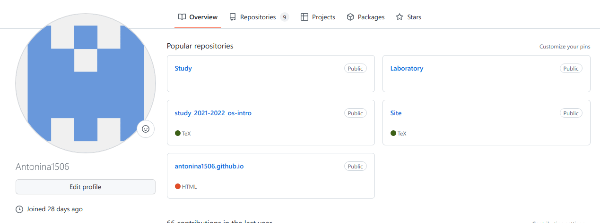{ #fig:008 width=80% }

## Изменение иконок для ссылок на научные ресурсы

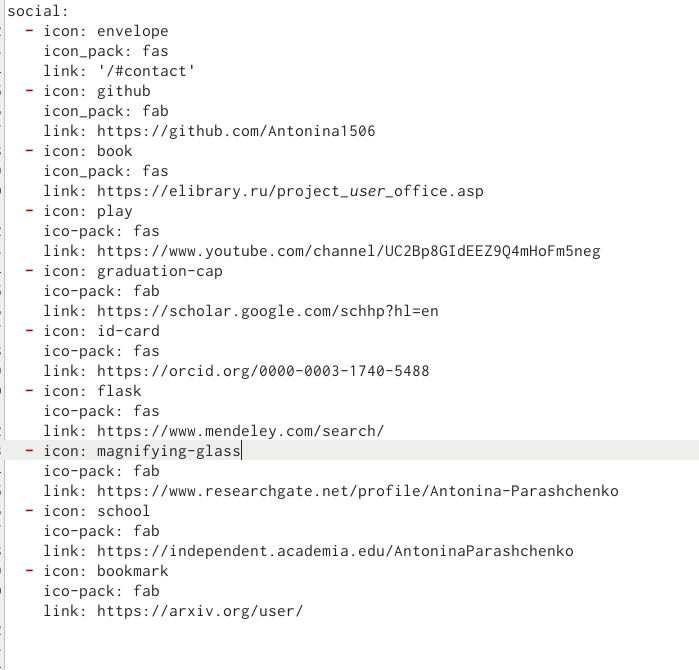{ #fig:009 width=70% }

## Изменение иконок для ссылок на научные ресурсы

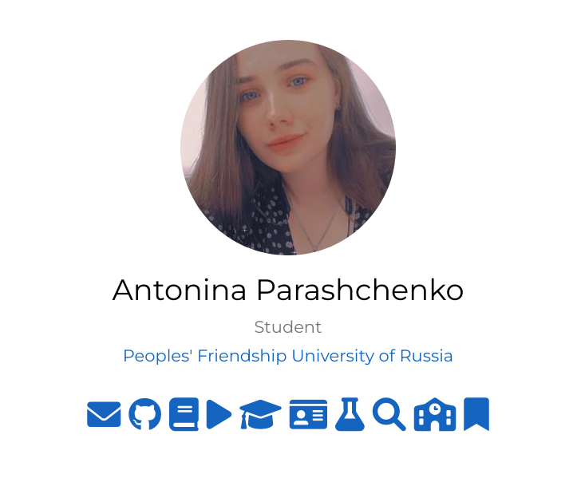{ #fig:010 width=70% }

## Пост по прошедшей неделе
	
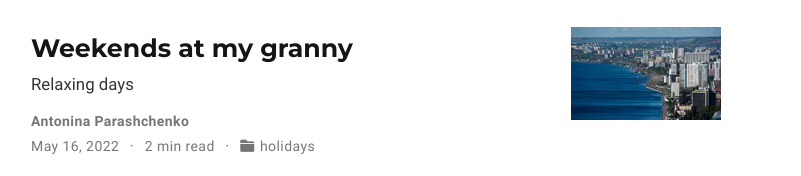{ #fig:011 width=90% }

## Пост на тему оформление отчёта в markdown 

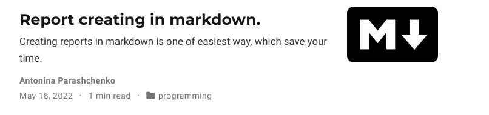{ #fig:012 width=90% }

# Выводы

Добавить к сайту ссылки на научные и библиометрические ресурсы.
