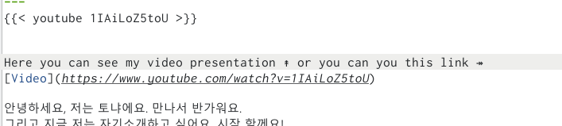
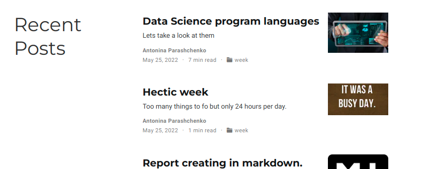

---
## Front matter
lang: ru-RU
title: Отчёт по пятому этапу проекта
author: |
	Паращенко Антонина
institute: |
	РУДН, Москва, Россия

date: 28 апреля 2022

## Formatting
toc: false
slide_level: 2
theme: metropolis
header-includes: 
 - \metroset{progressbar=frametitle,sectionpage=progressbar,numbering=fraction}
 - '\makeatletter'
 - '\beamer@ignorenonframefalse'
 - '\makeatother'
aspectratio: 43
section-titles: true
---

## Цель работы

Добавить с сайту все оставшиеся элементы.

# Выполнение лабораторной работы

## Создала записи для персонального проекта

{ #fig:001 width=50% }

## Создала записи для персонального проекта

{ #fig:002 width=50% }

## Затем добавила видео на страницу проекта 

{ #fig:003 width=80% }

## Затем добавила видео на страницу проекта 

{ #fig:004 width=60% }

## Написала пост по прошедшей неделе

{ #fig:005 width=50% }

## Написала пост по прошедшей неделе

{ #fig:006 width=50% }

## Написала пост про научные языки программирования 

{ #fig:007 width=50% }

## Написала пост про научные языки программирования 

{ #fig:008 width=50% }

## Итоги этапа 

{ #fig:009 width=80% }

## Итоги этапа 

{ #fig:010 width=70% }

## Выводы

Добавить к сайту посты и проект.
