---
## Front matter
lang: ru-RU
title: Отчёт по пятому этапу проекта
author: |
	Паращенко Антонина
institute: |
	РУДН, Москва, Россия

date: 28 апреля 2022

## Formatting
toc: false
slide_level: 2
theme: metropolis
header-includes: 
 - \metroset{progressbar=frametitle,sectionpage=progressbar,numbering=fraction}
 - '\makeatletter'
 - '\beamer@ignorenonframefalse'
 - '\makeatother'
aspectratio: 43
section-titles: true
---

# Цель работы

Разместить двуязычную версию сайта на Github.

# Выполнение этапа индивидуального проекта. Делаем поддержку английского и русского языков
## Создала в папке Site папку i18n.

{ #fig:001 width=70% }

## Коды для английской и русско версии сайта.

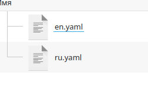{ #fig:002 width=70% }

## Создала файлы menus.en.yaml и menus.ru.yaml.

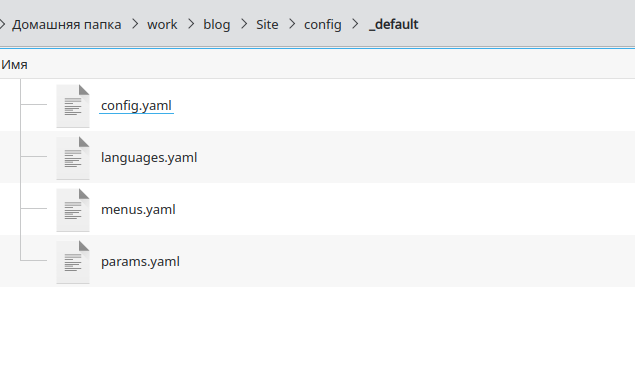{ #fig:003 width=70% }

## Создала файлы menus.en.yaml и menus.ru.yaml.

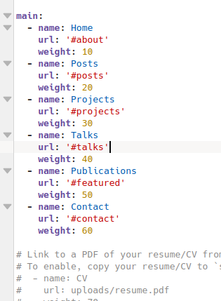{ #fig:004 width=50% }

## Создала файлы menus.en.yaml и menus.ru.yaml.

{ #fig:005 width=70% }

## В файл languages.yaml добавляем язык перевода.

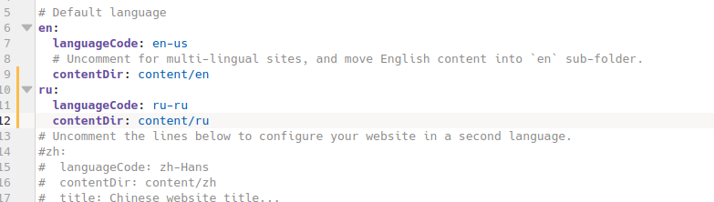{ #fig:006 width=70% }

## Создаём две папки ru и en и копируем все файлы в обе папки. 

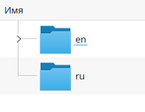{ #fig:007 width=70% }

## Переводим весь контент на другой язык. 

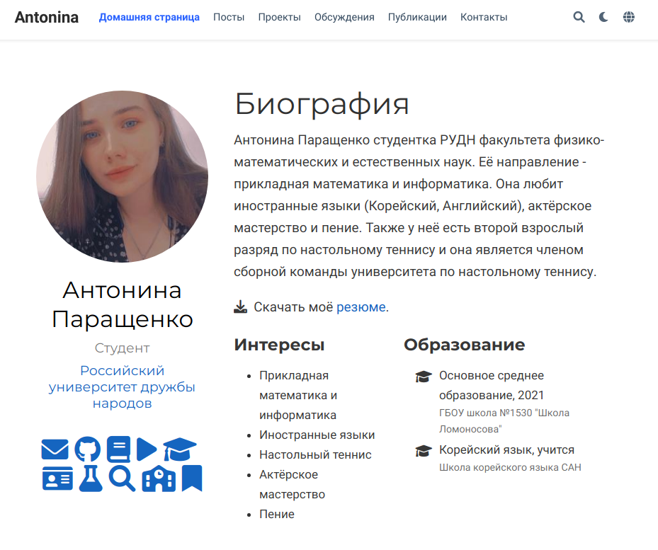{ #fig:008 width=70% }

## Переводим весь контент на другой язык. 

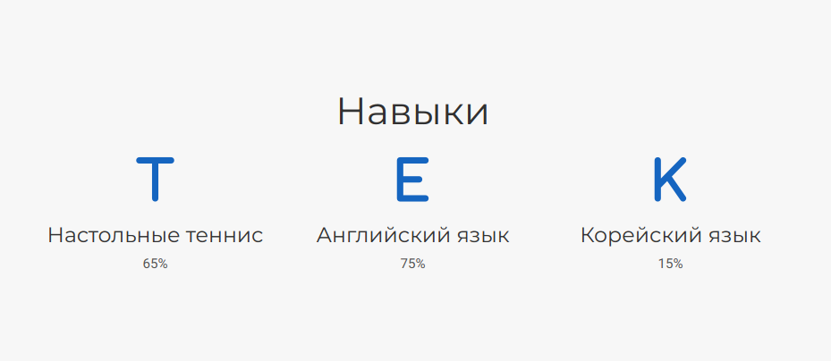{ #fig:009 width=70% }

## Переводим весь контент на другой язык. 

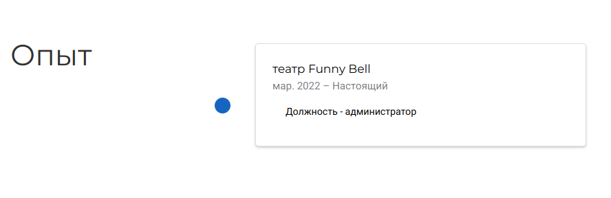{ #fig:010 width=70% }

## Переводим весь контент на другой язык. 

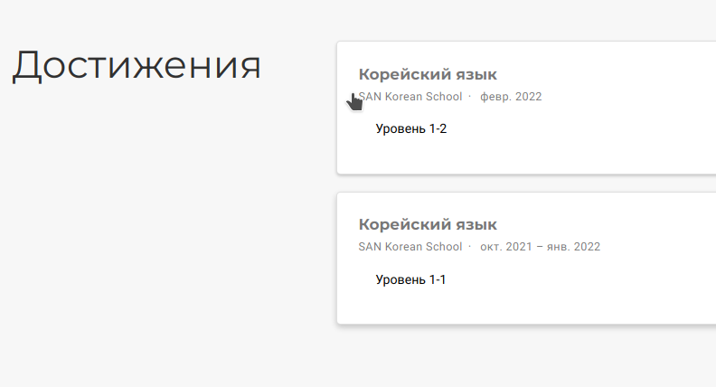{ #fig:011 width=70% }

## Переводим весь контент на другой язык. 

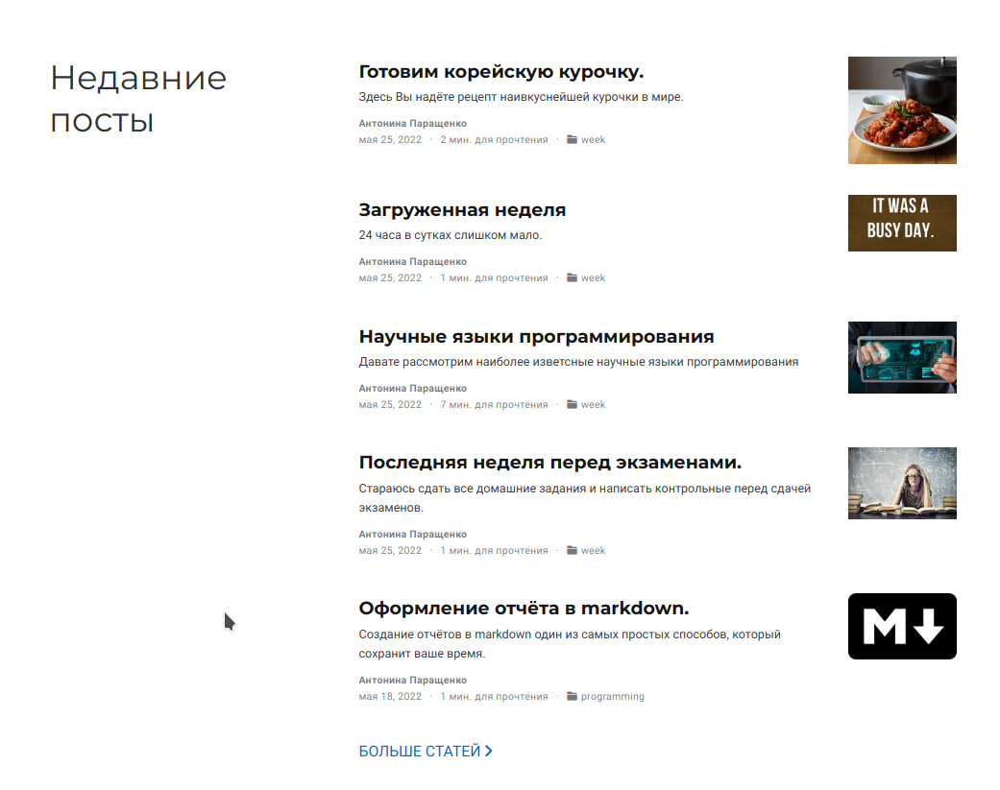{ #fig:012 width=70% }

## Переводим весь контент на другой язык. 

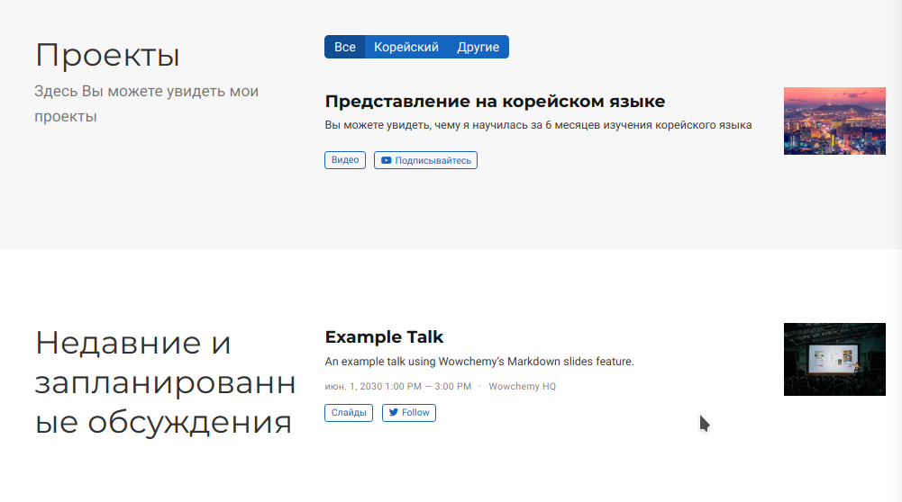{ #fig:013 width=70% }

## Переводим весь контент на другой язык. 

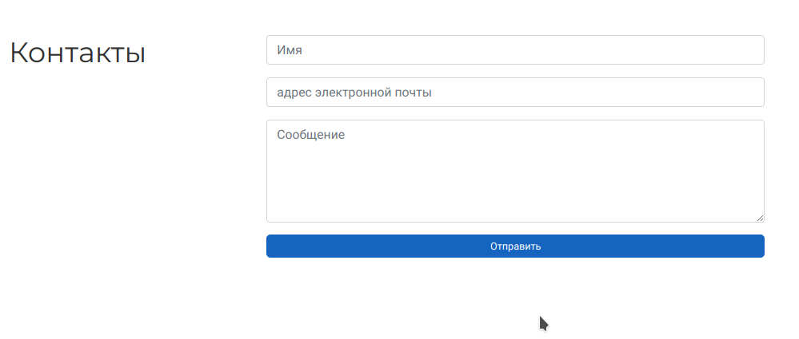{ #fig:014 width=70% }

## Пост по прошедшей недели.

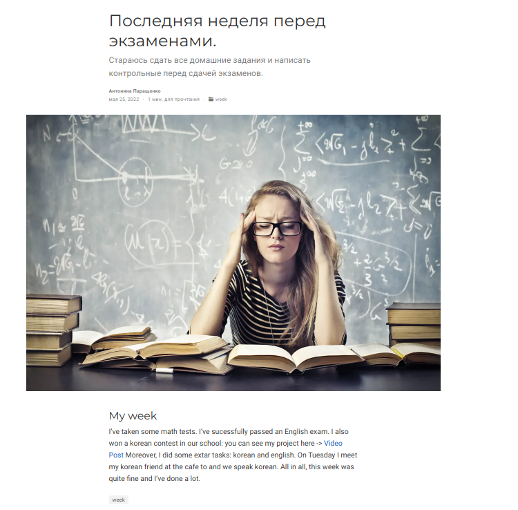{ #fig:015 width=70% }

## Пост на тему по выбору.

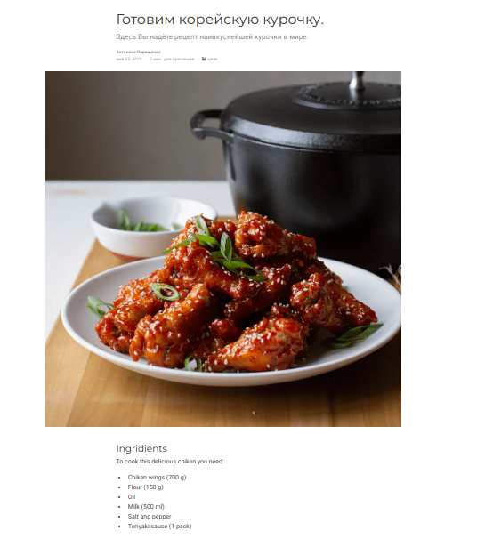{ #fig:016 width=60% }

## Выводы

Разместили двуязычную версию сайта на Github и добавили два поста.
