---
## Front matter
title: " Отчёт по шестому этапу проекта"
author: "Паращенко Антонина Дмитриевна"

## Generic otions
lang: ru-RU
toc-title: "Содержание"

## Bibliography
bibliography: bib/cite.bib
csl: pandoc/csl/gost-r-7-0-5-2008-numeric.csl

## Pdf output format
toc: true # Table of contents
toc-depth: 2
lof: true # List of figures
lot: true # List of tables
fontsize: 12pt
linestretch: 1.5
papersize: a4
documentclass: scrreprt
## I18n polyglossia
polyglossia-lang:
  name: russian
  options:
	- spelling=modern
	- babelshorthands=true
polyglossia-otherlangs:
  name: english
## I18n babel
babel-lang: russian
babel-otherlangs: english
## Fonts
mainfont: PT Serif
romanfont: PT Serif
sansfont: PT Sans
monofont: PT Mono
mainfontoptions: Ligatures=TeX
romanfontoptions: Ligatures=TeX
sansfontoptions: Ligatures=TeX,Scale=MatchLowercase
monofontoptions: Scale=MatchLowercase,Scale=0.9
## Biblatex
biblatex: true
biblio-style: "gost-numeric"
biblatexoptions:
  - parentracker=true
  - backend=biber
  - hyperref=auto
  - language=auto
  - autolang=other*
  - citestyle=gost-numeric
## Pandoc-crossref LaTeX customization
figureTitle: "Рис."
tableTitle: "Таблица"
listingTitle: "Листинг"
lofTitle: "Список иллюстраций"
lotTitle: "Список таблиц"
lolTitle: "Листинги"
## Misc options
indent: true
header-includes:
  - \usepackage{indentfirst}
  - \usepackage{float} # keep figures where there are in the text
  - \floatplacement{figure}{H} # keep figures where there are in the text
---

# Цель работы

Разместить двуязычную версию сайта на Github.

# Выполнение этапа индивидуального проекта
## Делаем поддержку английского и русского языков

1) Создала в папке Site папку i18n, которая отвечает за объявления доступных языков. (рис. [-@fig:001])

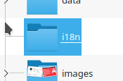{ #fig:001 width=70% }

2) С сайта [Instruction](https://wowchemy.com/docs/hugo-tutorials/language/) скопировала коды для английской и русско версии сайта и вставила код в текстовые файлы, которые создала в папке i18n. Немного заменила перевод некоторых разделов. (рис. [-@fig:002])

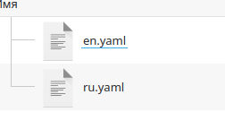{ #fig:002 width=70% }

3) Затем в папке ~/work/blog/Site/config/_default создала файлы menus.en.yaml и menus.ru.yaml, чтобы поменять язык меню. (рис. [-@fig:003]) - (рис. [-@fig:005])

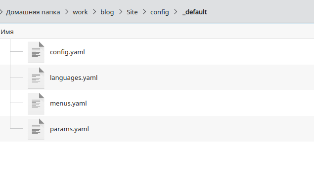{ #fig:003 width=70% }

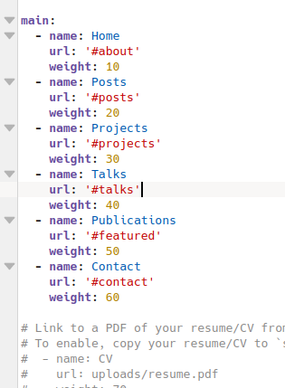{ #fig:004 width=70% }

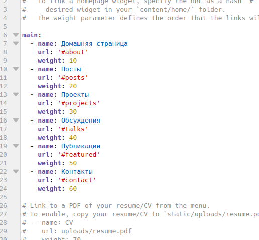{ #fig:005 width=70% }

4) В папке с файлами menus.en.yaml и menus.ru.yaml находим файл languages.yaml и добавляем язык перевода. (рис. [-@fig:006])

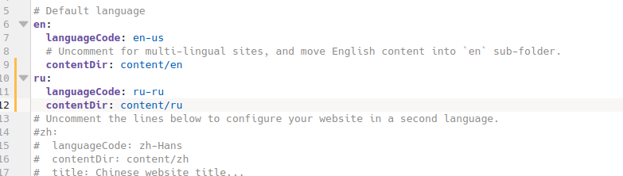{ #fig:006 width=70% }

5) Далее в папке content создаём две папки ru и en. И копируем все файлы в обе папки. Заходим в папку с языком, на который мы собираемся переводить (сайт был на английском, переходи в папку ru). (рис. [-@fig:007])

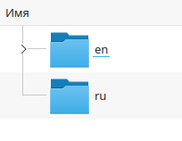{ #fig:007 width=70% }

6)Переводим весь контент на другой язык. (рис. [-@fig:008]) - (рис. [-@fig:014])

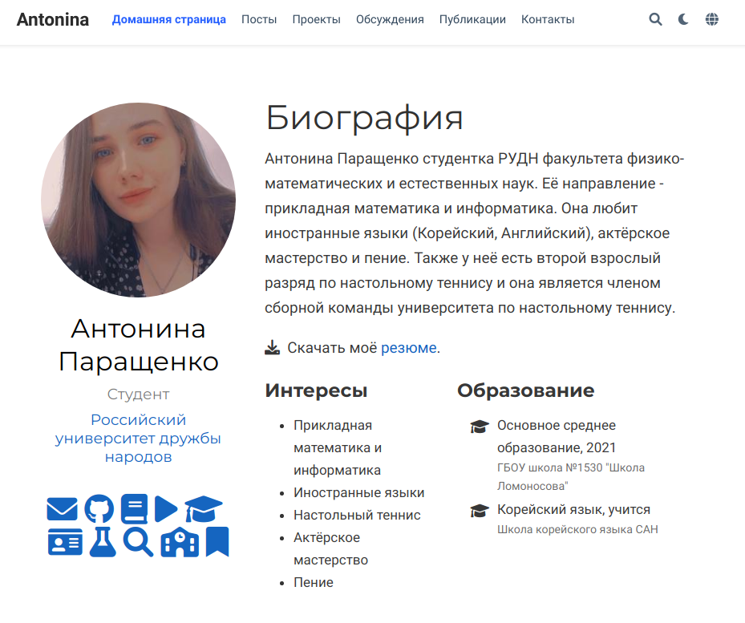{ #fig:008 width=70% }

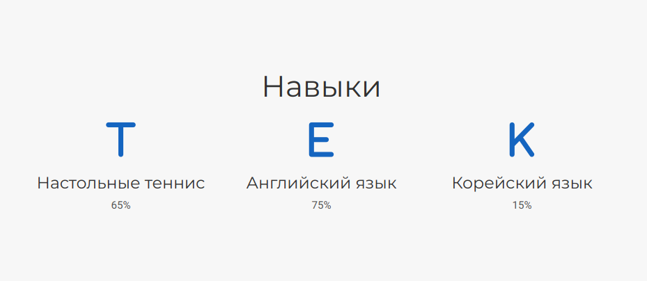{ #fig:009 width=70% }

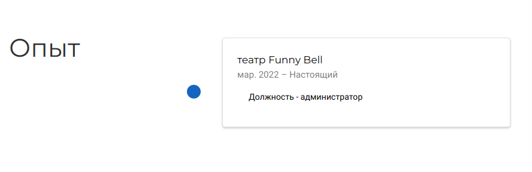{ #fig:010 width=70% }

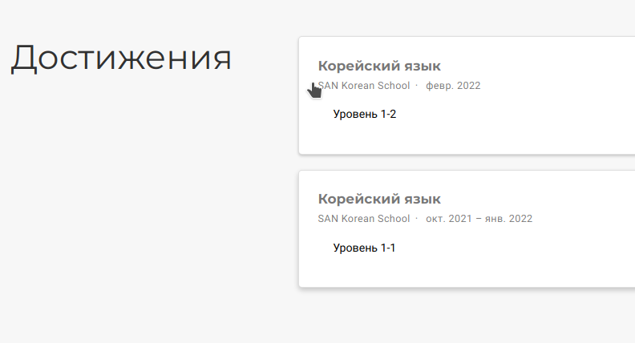{ #fig:011 width=70% }

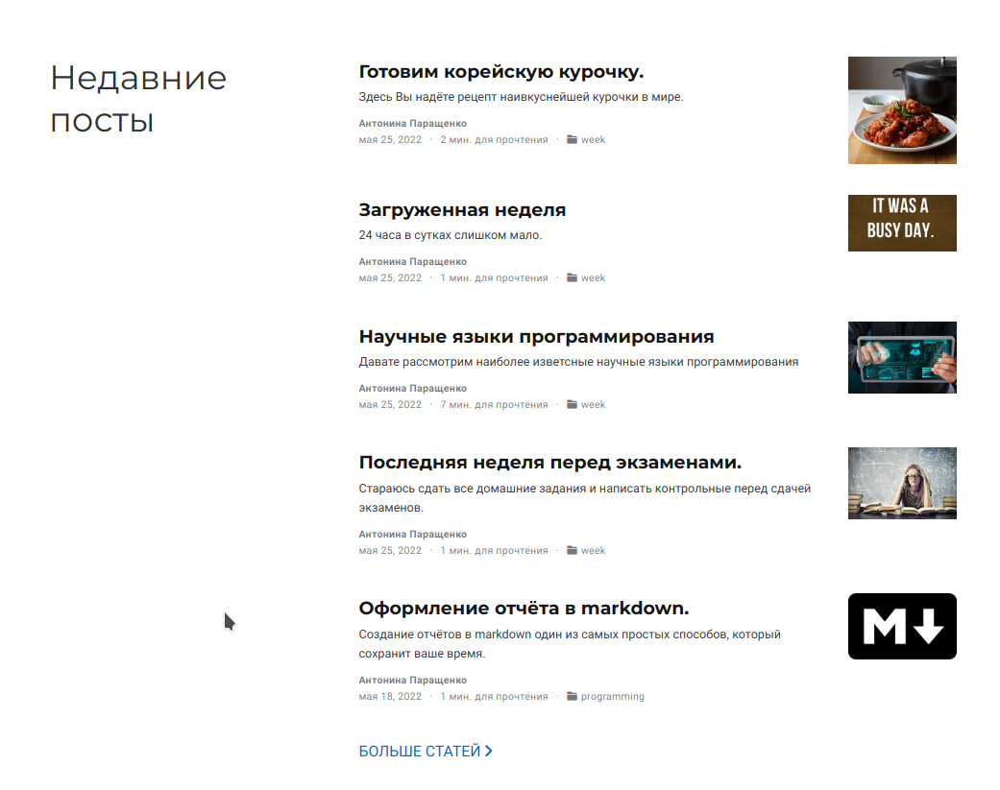{ #fig:012 width=70% }

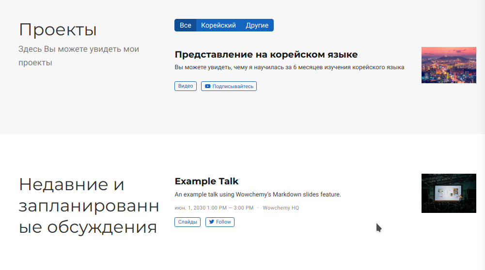{ #fig:013 width=70% }

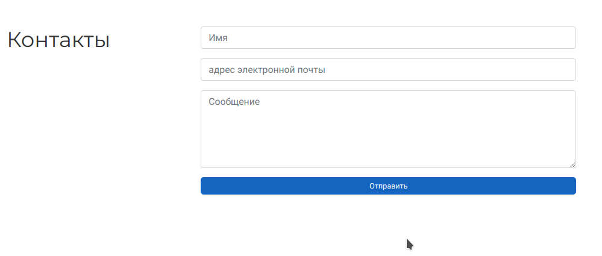{ #fig:014 width=70% }

7) Пишем пост по прошедшей недели (рис. [-@fig:015]) 

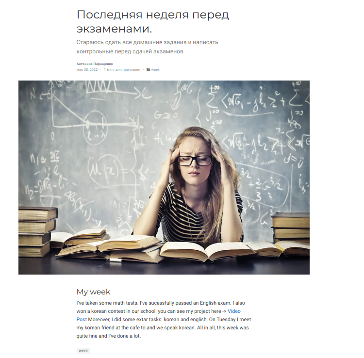{ #fig:015 width=70% }

8) Пишем пост на тему по выбору. Моя тема - рецепт корейской курочки (рис. [-@fig:015]) 

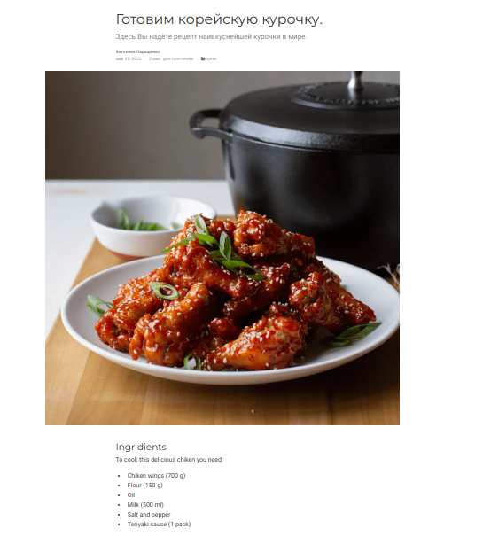{ #fig:016 width=70% }

# Выводы

Разместили двуязычную версию сайта на Github и добавили два поста.
